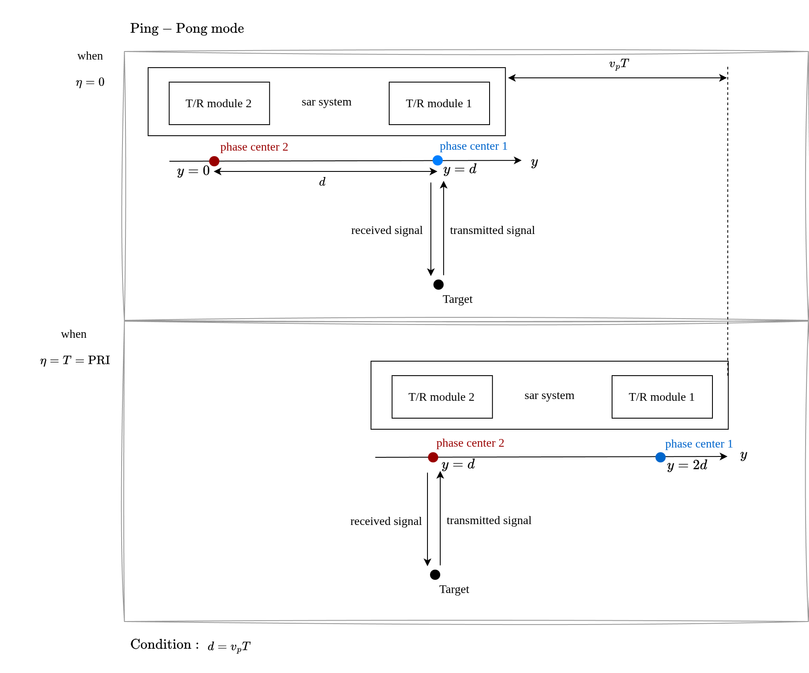
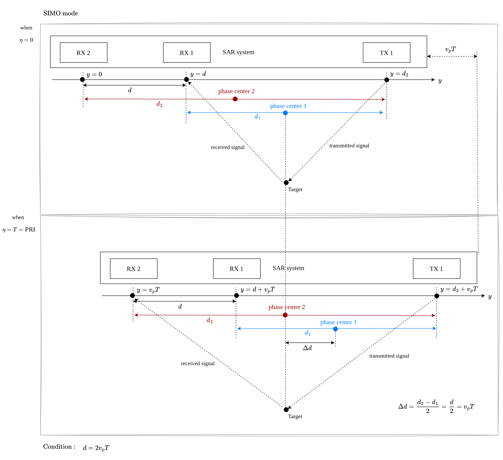

# DPCA for SAR Imaging

## Outline

- [Summary](#summary)
- [1. DPCA Concept and Motivation](#1-dpca-concept-and-motivation)
  - [1.1. Why Displacement Phase Center Antenna (DPCA)](#11-why-displacement-phase-center-antenna-dpca)
  - [1.2. Displaced Phase Center and Effective PRF](#12-displaced-phase-center-and-effective-prf)
  - [1.3. Imaging Enhancement](#13-imaging-enhancement)
- [2. Geometric Conditions](#2-geometric-conditions)
  - [2.1. Geometric Condition](#21-geometric-condition)
  - [2.2. Mismatched Spacing Condition](#22-mismatched-spacing-condition)
- [3. Conclusions and Trade-offs](#3-conclusions-and-trade-offs)
  - [3.1. Trade-off between Resolution, NESZ](#31-trade-off-between-resolution-nesz)
  - [3.2. DPCA-based GMTI and its trade-offs](#32-dpca-based-gmti-and-its-trade-offs)
- [4. Follow-up Topics](#4-follow-up-topics)

## Summary

- 為了達成HRWS成像
- DPCA用以增加方位向取樣率（等效PRF），可以讓方位解析度變好並且不會減少swath width
- Rx gain的收到的能量下降，導致NESZ變大
- DPCA的trade-off是用NESZ換azimuth resolution

## 1. DPCA Concept and Motivation

### 1.1. Why Displacement Phase Center Antenna (DPCA)

- **High-resolution (azimuth resolution) and wide-swath (HRWS) are contradictions** with the conventional single-channel spaceborne SAR systems.
- Higher PRF is needed for high-resolution, but it reduces the (unambiguous) swath width.
- DPCA improves azimuth sampling without requiring the true PRF to increase by the same factor, so the swath-width penalty can be relaxed.

| Goal | Requires | Costs / Limits |
|---|---|---|
| High azimuth resolution | High PRF | Reduced swath width |
| Wide swath width | Low PRF | Reduced azimuth resolution |
| HRWS | DPCA | Added system complexity |

### 1.2. Displaced Phase Center and Effective PRF

- Displaced phase center creates **multiple phase centers** along the flight direction (along-track / azimuth direction), which effectively increase the sampling rate in azimuth.
    - Phase center is the effective transmit/receive center of the antenna aperture.
- Two main DPCA configurations are:
    - **Ping-pong mode**: 
        - 
        - The aft-antenna collects the data from the same points as the fore-antenna with a time delay.
        - The condition of baseline $d = v_p T$ is required for the ping-pong mode to achieve the desired effective sampling.
        - 實際上 $v_p$ 是固定的， $T=\mathrm{PRI}= 1 / \mathrm{PRF}$ 雖然可調整，但是也會受限 nadir return, TX eclipse等因素，所以 PRI 的調整空間有限，為了要有DPCA這個功能，要符合上述的condition, PRI的調整空間就更有限了。
        - 兩個 TX 都會發射，兩個 RX 都會接收，不然Gain會掉更多。
        - 實際上TX發射之後，RX1, RX2都會收訊號但是，上圖phase center 2的訊號丟掉不要，下圖phase center 1的訊號丟掉不要。(TX1, TX2 都會發射，RX1, RX2 都會接收嗎？)
        - 目前SAR採用ping-pong mode
        - Simulation: 在 $\eta=0$ 的時候，phase center 1接收的訊號，跟 $\eta=T$ 的時候，phase center 2接收的訊號，是來自同一個地物點的回波。 但是 phase 會不一樣，因為 TX phase center 不同， 會差一個 frequency offset。可以用作模擬？
        - TerraSAR 是用 ping-pong mode, 一半primary antenna，一半 redundant antenna

    - **SIMO mode**: 
        - 
        - Use one TX and multiple RX to create multiple phase centers.
        - The condition of baseline $d = 2v_p T$ is required for the SIMO mode to achieve the desired effective sampling.

- Once the effective sampling condition is satisfied, the effective PRF is doubled, which can improve the azimuth resolution without reducing the swath width.
- **For example, with two phase centers, the effective PRF doubles.**

### 1.3. Imaging Enhancement

- DPCA increases the effective sampling rate in the along-track direction (PRF), which can be interpreted as an increase in effective PRF.
- This is because the multiple phase centers create additional spatial samples within one pulse interval ( $T = \mathrm{PRI}$ ).

For a conventional single-channel SAR system, the along-track sampling spacing $(\Delta y)$ is

$$
\Delta y = v_p \cdot \mathrm{PRI} = \frac{v_p}{\mathrm{PRF}}
$$

where $v_p$ is the platform velocity and $\mathrm{PRF}$ is the pulse repetition frequency.

If DPCA provides $N$ effective phase centers and the geometric condition is properly matched, the effective sampling spacing becomes

$$ 
\Delta y_{\mathrm{eff}} \approx \frac{v_p}{N \cdot \mathrm{PRF}} \approx \frac{v_p}{\mathrm{PRF}_{\mathrm{eff}}}
$$

Thus, the effective PRF is increased by a factor of $N$

## 2. Geometric Conditions

### 2.1. Geometric Condition

- The effective-sampling interpretation of DPCA is only valid when the **platform motion** and the **phase-center spacing** are properly matched.
- During one pulse repetition interval $T$, the platform moves

$$
\Delta y = v_p T
$$

where $v_p$ is the platform velocity.

- For the ping-pong mode, the matched condition is

$$
d = v_p T
$$

- For the 1-TX/2-RX SIMO case discussed here, the matched condition is

$$
d = 2 v_p T
$$

- Under the mismatched condition, the additional samples are no longer uniformly distributed in azimuth.
-   Therefore, the validity of the effective-PRF interpretation depends on whether the phase-center geometry is matched to the platform motion.

### 2.2. Mismatched Spacing Condition

- In the mismatched case, the phase-center spacing does not satisfy the required geometric relation, so the additional azimuth samples are not placed at the intended along-track positions.
- As a result, the effective sampling grid becomes nonuniform, which means the Doppler-domain samples are no longer supported on the ideal uniform sampling structure.
- Physically, this makes the effective-PRF interpretation less accurate and the expected imaging benefit weaker.
- 還是可以改善解析度，但效果沒有matched case好。

## 3. Conclusions and Trade-offs 

### 3.1. Trade-off between Resolution, NESZ

- Noise-Equivalent Sigma Zero (NESZ，等效雜訊後向散射係數) 是衡量 SAR 系統雜訊水平的核心指標。
    - 定義：NESZ 是雷達系統本身在『未接收到外部信號時』，內部硬體產生的『背景噪聲轉換為後向散射係數 $\sigma^0$ 的數值』，通常以分貝（dB）表示。
      - 後向散射係數（Backscattering Coefficient）是量化目標物將雷達波束反射回雷達接收器的能力之指標。它代表單位面積的反射率，通常以分貝（dB）表示。
    - NESZ 代表雷達內部雜訊對應到的最小可探測地物散射強度。
    - 其數值越低表示雷達系統靈敏度越高，越能分辨低反射率的目標，成像品質越好。
    - 後向散射係數（ $\sigma^0$ Backscattering Coefficient）是量化目標物將雷達波束反射回雷達接收器的能力之指標。它代表單位面積的反射率，通常以分貝（dB）表示。

- A commonly used NESZ model can be written as:

$$
\mathrm{NESZ}=\frac{
4\cdot(4\pi)^3 R^3 V_s \sin\psi \cdot L_{atm}
\cdot B\!\left(G_{rx}\cdot N_{cell,r}\cdot kT_K\cdot N_F + N_Q\right)}
{0.886\cdot G_{rx}\cdot N_{cell,t}\cdot N_{cell,r}\cdot P_t\cdot G_t\cdot G_r\cdot \lambda^3\cdot c\cdot T_c\cdot PRF}
$$

- where $R$ is slant range, $V_s$ is platform velocity, $\psi$ is incidence angle, $L_{atm}$ is atmospheric loss, $B$ is receiver bandwidth, $G_{rx}$ is receiver gain, $N_{cell,t}$/$N_{cell,r}$ are Tx/Rx channel counts, $k$ is Boltzmann constant, $T_K$ is system temperature, $N_F$ is noise factor, $N_Q$ is quantization noise term, $P_t$ is transmit power, $G_t$/$G_r$ are Tx/Rx antenna gains, $\lambda$ is wavelength, $c$ is light speed, and $T_c$ is coherent integration time.

- Relation between NESZ and SNR: 

$$
\mathrm{SNR} \propto \frac{\sigma^0}{\mathrm{NESZ}}
\propto \frac{1}{\mathrm{NESZ}}
$$

- The bigger Doppler bandwidth, the better (smaller) azimuth resolution.

$$
\delta_a = \frac{V_p}{B_a}
$$

- The result of higher effective PRF:
  - 更大的 Doppler bandwidth $B_a$，可以獲得更細的 azimuth resolution $\delta_a$。
  - 但每個 resolution cell 內可累積的能量下降，意味著該 cell 反彈回雷達的總能量變少。
  - SNR 變低、變差
  - NESZ 變大、變差

- 這裡的 trade-off 是：**用 NESZ 換 azimuth resolution**。

### 3.2. DPCA-based GMTI and its trade-offs

- TBC (用三句話講完)

### 3.3. DPCA-based point target simulation

Q:「我以為是我做完DPCA，RDA成像resolution比原來小一半」：
A: 這是錯的。做完 DPCA，影像是用來顯示「動態目標」的，解析度取決於原來的頻寬與孔徑，不會因為「相減」這個動作而讓解析度變細

Q: 然後沒滿足 $d=v_p T$ 的dpca的成像結果會比原來好，但沒有好到，for example resolution小一半？
A :這也是錯的。在 DPCA 中沒滿足條件，下場是「影像充滿了沒有消乾淨的殘影雜訊」，導致你找不到移動目標

如果你想模擬的是「解析度提升」： 你不應該做 DPCA（相減），而是應該模擬「MIMO-SAR 方位角多通道重建」。此時你要刻意設計延遲或不同的發射模式，讓每個通道的等效相位中心（EPC）均勻錯開（避免重疊），然後用頻譜重建演算法把它們合在一起，證明解析度獲得了提升？？？

若要模擬多通道信號重建以達到解析度提升（即高解析度寬測繪帶，HRWS 成像），您需要模擬 MIMO-SAR（多發多收合成孔徑雷達） 的空間採樣與信號拼接過程。？？？

## 4. Follow-up Topics

- DPCA paper survey
- Derive of the conditions of two modes.
- How to simulate DPCA?
- How to simulate DPCA with mismatched condition?

| 衛星公司 | 衛星/星系名稱 | 實現機制 | 備註與商用產品應用 |
| :--- | :--- | :--- | :--- |
| MDA | RADARSAT-2, RCM | 真實多通道 (MODEX) | 可執行標準的 DPCA 與 ATI 演算法，專為 GMTI 設計。 |
| Airbus | TerraSAR-X, PAZ | 真實多通道 (DRA) | 具備高精確度的 DPCA 測速能力，能有效對消靜態地物雜波。 |
| Capella Space | Capella Constellation | 單天線 Sub-aperture (頻譜分割 Spectral Splitting) | 產品為 CSI，利用聚束模式切分不同都卜勒頻寬來標定移動目標。 |
| ICEYE | ICEYE Constellation | 單天線 Sub-aperture (長駐留時間 Long-dwell 處理) | 類似 Video SAR，透過多幀次孔徑影像觀察大型移動目標（如船隻航跡）。 |

- **實現機制 (硬體 DPCA vs 軟體 Sub-aperture)**：硬體機制通常具有真實的多個接收通道；而軟體機制多基於單一天線，透過信號處理（如切分都卜勒頻譜或長時間觀測）來模擬或形成次孔徑。
- **MODEX**：一種真實多通道操作模式，接收時將天線物理上分為前後兩半部 (Fore/Aft)。
- **DRA (Dual Receive Antenna)**：雙接收天線模式，透過切分天線接收訊號。
- **GMTI (Ground Moving Target Indication)**：地面移動目標指示，用於偵測地面上的運動目標。
- **ATI (Along-Track Interferometry)**：沿軌干涉技術，常用於測速與動態目標偵測。
- **CSI (Colorized Sub-aperture Image)**：彩色次孔徑影像，將不同都卜勒頻寬的次孔徑影像映射至不同顏色通道合成，用以凸顯/標定移動目標。
- **Video SAR**：以高幀率連續生成 SAR 影像，形成類似影片的動態觀測效果，適合監測移動目標。
