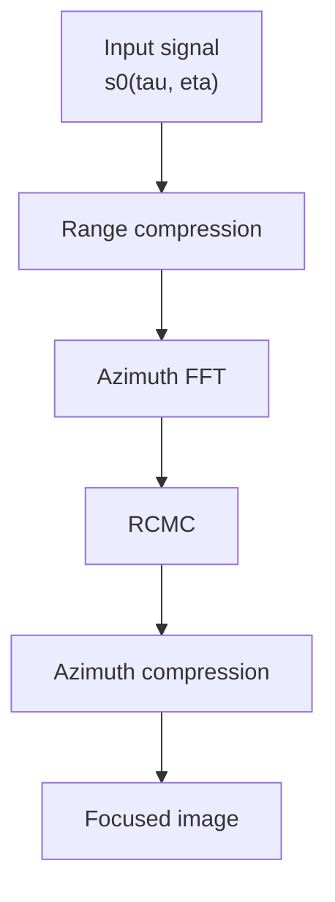

# RDA for SAR Imaging

## Outline

- [1. Summary](#1-summary)
- [2. Physical Meaning and Key Mathematics](#2-physical-meaning-and-key-mathematics)
- [3. Core Processing Flow](#3-core-processing-flow)
  - [3.1. Range Compression](#31-range-compression)
  - [3.2. Azimuth FFT](#32-azimuth-fft)
  - [3.3. RCMC](#33-rcmc)
  - [3.4. Azimuth Compression](#34-azimuth-compression)
- [4. Main Risks of Using RDA](#4-main-risks-of-using-rda)
- [5. Algorithm Decision Support](#5-algorithm-decision-support)
- [6. Parameters Still Needed](#6-parameters-still-needed)

## 1. Summary

- **RDA (Range-Doppler Algorithm)** is one of the most classical frequency-domain SAR focusing algorithms.
- Its core idea is to move the signal into the **range-Doppler domain**, correct range migration there, and then complete azimuth focusing.
- The main chain is **range compression -> azimuth FFT -> RCMC -> azimuth compression**.
- RDA is a strong baseline for low-squint and moderate-complexity systems, but its approximation error becomes more visible in high-resolution and large-squint regimes.

## 2. Physical Meaning and Key Mathematics

RDA mainly solves two coupled problems:

- the target echo migrates across range cells during aperture time
- the azimuth phase history must be coherently compressed

For a point target with closest slant range $R_0$, the slant-range history is

$$
R(\eta)=\sqrt{R_0^2+V_r^2\eta^2}
\approx R_0+\frac{V_r^2\eta^2}{2R_0}.
$$

This produces a quadratic azimuth phase history:

$$
\phi(\eta)\approx -\frac{4\pi}{\lambda}R_0
-\frac{2\pi V_r^2}{\lambda R_0}\eta^2.
$$

The corresponding instantaneous Doppler frequency is

$$
f_\eta=\frac{1}{2\pi}\frac{d\phi(\eta)}{d\eta}
=-\frac{2V_r^2}{\lambda R_0}\eta.
$$

This is the key approximation behind RDA: under low-squint conditions, azimuth time $\eta$ and Doppler frequency $f_\eta$ can be mapped to each other. If the migration term

$$
\Delta R(\eta)=\frac{V_r^2\eta^2}{2R_0}
$$

is rewritten in Doppler coordinates, the range migration becomes

$$
\Delta R(f_\eta)=\frac{\lambda^2R_0}{8V_r^2}f_\eta^2.
$$

**Physical meaning:** inside the same Doppler bin, the signal experiences the same migration amount, so RCMC can be applied consistently in the range-Doppler domain before azimuth compression.

The stage-signal view is:

| Stage | Signal | Main meaning |
|---|---|---|
| Input | $s_0(\tau,\eta)$ | Raw received echo |
| After range compression | $s_1(\tau,\eta)$ | Range-focused but still azimuth-defocused |
| After RCMC | $S_{\mathrm{rcmc}}(\tau,f_\eta)$ | Migration-corrected range-Doppler signal |
| After azimuth compression | $I_{\mathrm{focus}}(\tau,\eta)$ | Final focused image |

## 3. Core Processing Flow

If your current Markdown viewer still does not render this Mermaid block, the issue is likely the viewer, not the note itself. GitHub supports Mermaid, but some local Markdown previews do not.

### 3.1. Range Compression

Range compression applies the range matched filter and collapses the transmitted chirp in fast time. Its input is the raw echo $s_0(\tau,\eta)$, and its output is the range-compressed signal $s_1(\tau,\eta)$. This step is necessary because later Doppler-domain processing assumes the range response is already localized.

$$
s_1(\tau,\eta)\propto
\mathrm{sinc}\biggl[ B_r \biggl( \tau-\frac{2R(\eta)}{c} \biggr) \biggr]
\exp \biggl[ -j\frac{4\pi f_0R(\eta)}{c} \biggr].
$$

### 3.2. Azimuth FFT

Azimuth FFT converts the slow-time signal into azimuth frequency and produces the range-Doppler representation. Its input is $s_1(\tau,\eta)$, and its output is $S_1(\tau,f_\eta)$. This step is necessary because migration correction and azimuth phase compensation are easier to organize in Doppler coordinates.

### 3.3. RCMC

RCMC shifts each Doppler bin by the corresponding migration amount so that the target no longer walks across range cells. Its input is $S_1(\tau,f_\eta)$, and its output is $S_{\mathrm{rcmc}}(\tau,f_\eta)$. This step is necessary because azimuth compression will misfocus the target if migration is not corrected first.

$$
S_{\mathrm{rcmc}}(\tau,f_\eta)\approx
S_1\biggl(\tau+\Delta\tau_{\mathrm{rcmc}}(f_\eta),f_\eta\biggr).
$$

### 3.4. Azimuth Compression

Azimuth compression applies the azimuth matched filter that removes the residual quadratic phase history. Its input is $S_{\mathrm{rcmc}}(\tau,f_\eta)$, and its output is the focused image $I_{\mathrm{focus}}(\tau,\eta)$. This step is necessary because SAR azimuth resolution comes from coherent synthetic-aperture integration, not from range compression alone.

$$
I_{\mathrm{focus}}(\tau,\eta)=
\mathcal{F}^{-1}_{f_\eta}
\left\{
S_{\mathrm{rcmc}}(\tau,f_\eta)H_{\mathrm{az}}(f_\eta)
\right\}.
$$

## 4. Main Risks of Using RDA

### 4.1. Risk: Ignoring SRC causes defocus in high-resolution regimes

**Risk:** Basic RDA assumes range and azimuth can be separated cleanly, but this becomes weaker when bandwidth grows or squint becomes larger. Directly using basic RDA can produce visible edge defocus.  
**Recommended alternative:** add secondary range compression (SRC) or move to CSA.

### 4.2. Risk: RCMC interpolation becomes a precision and performance bottleneck

**Risk:** RCMC requires interpolation across range cells, and interpolation quality directly affects sidelobes, artifacts, and memory-access cost. In hardware-oriented flows, this step often becomes the most painful implementation bottleneck.  
**Recommended alternative:** if throughput and regular memory access dominate, prefer CSA because it avoids explicit interpolation.

### 4.3. Risk: Motion compensation is harder under non-ideal platform trajectories

**Risk:** RDA is derived under relatively ideal motion assumptions, so strong nonlinear platform motion is harder to absorb precisely in the frequency domain. Residual phase error then appears as blur and imperfect focusing.  
**Recommended alternative:** if trajectory irregularity is severe, prefer BPA or another time-domain method.

## 5. Algorithm Decision Support

### 5.1. RDA vs CSA vs BPA

| Algorithm | Complexity | Advantages | Disadvantages |
|---|---|---|---|
| **RDA** | $O(N^2 \log N)$ | Clear structure, easy baseline implementation, good teaching value | Needs RCMC interpolation, weaker in large-squint or high-resolution regimes |
| **CSA** | $O(N^2 \log N)$ | No explicit interpolation, better hardware friendliness, handles stronger coupling better | More complex mathematics, more sensitive to model assumptions |
| **BPA** | $O(N^3)$ | Highest geometric fidelity, naturally handles complex motion | Very expensive computationally, difficult for real-time systems |

### 5.2. What Each Choice Sacrifices

| Choice | Main gain | Main sacrifice |
|---|---|---|
| Choose **RDA** | Simpler staged implementation | Lower accuracy margin in stressed geometries |
| Choose **CSA** | Better frequency-domain efficiency | Harder derivation and debugging |
| Choose **BPA** | Best geometric robustness | Much higher compute cost |

### 5.3. Current Technical Position

| Algorithm | Domain | Main strength | Main limitation | Typical role today |
|---|---|---|---|---|
| RDA | Frequency-domain staged focusing | Foundational baseline and easy interpretability | Approximation and interpolation sensitivity | Baseline processor and teaching reference |
| CSA | Frequency-domain focusing | Better coupling handling without explicit interpolation | Higher mathematical complexity | Practical upgrade over RDA in many systems |
| Omega-K | Wavenumber-domain focusing | Better treatment of broader coupling structure | More involved implementation | Higher-fidelity frequency-domain alternative |
| BPA | Time-domain image formation | Best motion and geometry flexibility | Heavy compute burden | Difficult-geometry or reference-quality solution |

## 6. Parameters Still Needed

If the goal is to choose an implementation direction rather than only study the algorithm, the key missing parameters are:

- highest required range resolution
- highest required azimuth resolution
- squint-angle range
- how ideal or non-ideal the platform trajectory is
- whether the target implementation is CPU, CUDA, FPGA, AIE, or another accelerator
- whether the target is an educational simulator, offline image former, or near-real-time system

The two most important questions are:

- What is your highest required resolution?
- What squint-angle range do you need to support?
