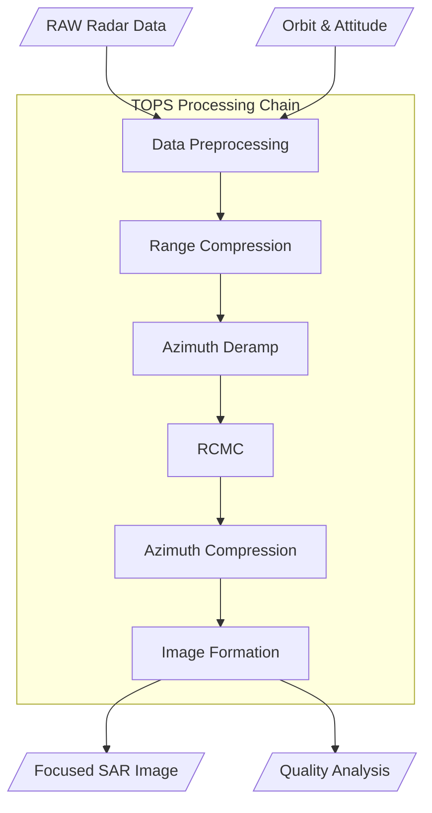

# SAR TOPS Mode Simulator

## Summary

This code provides a test for the TOPS (Terrain Observation with Progressive Scans) mode SAR imaging algorithm.
The code is written in a notebook for convenient debugging.
This README discusses the flowchart and physical explanation of this algorithm.

---

## Notes

### Derivation Note Skill

This repository includes a local writing skill for GitHub-safe math and physics derivation notes:

- [github-readme-math-physics-derivation](./.codex/skills/github-readme-math-physics-derivation/SKILL.md)

Use this skill when creating or rewriting derivation documents under `derive/`.

The skill enforces these repository conventions:

- every major processing stage must include a fully expanded closed form
- every derivation note must include `Navigation` and a clickable `Table of Contents`
- table-of-contents entries must be in English
- links between Markdown files must use repository-relative paths so they still work:
  - on GitHub after push
  - in a fresh local clone on another machine
  - in local Markdown preview

The current TOPS derivation note set is organized here:

- [TOPS Azimuth Overall](./derive/tops_azimuth_overall.md)
- [Range Compression](./derive/range_compression.md)
- [Azimuth Frequency UFR](./derive/azimuth_freq_ufr.md)
- [Azimuth Compression](./derive/azimuth_compression.md)
- [Azimuth Time UFR](./derive/azimuth_time_ufr.md)

---

## 2. Block Diagram

