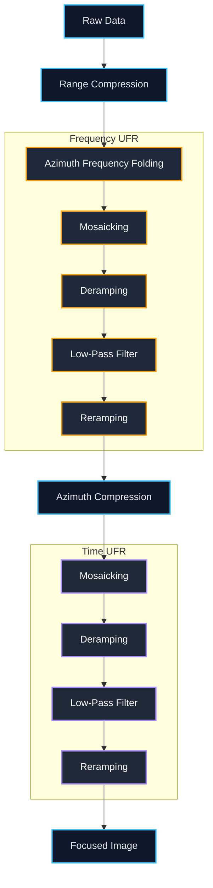

# SAR TOPS Mode Simulator

Simulation and derivation workspace for TOPS (Terrain Observation with Progressive Scans) SAR azimuth processing, with emphasis on folding, UFR, deramping, azimuth compression, and the physical meaning of each stage.

## Table of Contents

- [Flowchart](#flowchart)
- [Overview](#overview)
- [Reading Path](#reading-path)
- [Repository Structure](#repository-structure)
- [Documentation Standard](#documentation-standard)
- [Project Status](#project-status)

## Flowchart

### Processing Flow Chart



- [Raw Data](#1-raw-data)
- [Range Compression](#2-range-compression)
- [Azimuth Frequency Unfolding And Resampling (UFR)](#3-azimuth-frequency-unfolding-and-resampling-ufr)
  - [Azimuth Frequency Folding](#31-azimuth-frequency-folding)
  - [Mosaicking](#32-mosaicking)
  - [Deramping](#33-deramping)
  - [Low Pass Filter](#34-low-pass-filter)
  - [Reramping](#35-reramping)
- [Azimuth Compression](#4-azimuth-compression)
- [Azimuth Time Unfolding And Resampling (UFR)](#5-azimuth-time-unfolding-and-resampling-ufr)
  - [Mosaicking](#51-mosaicking)
  - [Deramping](#52-deramping)
  - [Low Pass Filter](#53-low-pass-filter)
  - [Reramping](#54-reramping)
- [Focused Image](#6-focused-image)

## Overview

This repository is not just an implementation sandbox. It is a combined engineering and derivation workspace for understanding how TOPS azimuth processing evolves from raw phase history to focused output, and why additional unfolding steps are required in both frequency and time domains.

The documentation is organized so that a reader can move between:

- high-level processing flow
- stage-by-stage mathematical derivations
- teaching-style notebooks that visualize intermediate results
- repository-local writing rules for math-heavy technical notes

## Reading Path

If you are new to this repository, the cleanest path is:

1. [TOPS Azimuth Overall](/home/hsuyueh.chuang/Desktop/vscode/github/sar_tops_mode/derive/tops_azimuth_overall.md)
2. [Range Compression](/home/hsuyueh.chuang/Desktop/vscode/github/sar_tops_mode/derive/range_compression.md)
3. [Azimuth Deramp LPF](/home/hsuyueh.chuang/Desktop/vscode/github/sar_tops_mode/derive/azimuth_deramp_LPF.md)
4. [Azimuth Compression](/home/hsuyueh.chuang/Desktop/vscode/github/sar_tops_mode/derive/azimuth_compression.md)
5. [Azimuth Frequency Folding](/home/hsuyueh.chuang/Desktop/vscode/github/sar_tops_mode/derive/azimuth_freq_folding.md)
6. [Azimuth Frequency UFR](/home/hsuyueh.chuang/Desktop/vscode/github/sar_tops_mode/derive/azimuth_freq_ufr.md)
7. [Azimuth Time Folding](/home/hsuyueh.chuang/Desktop/vscode/github/sar_tops_mode/derive/azimuth_time_folding.md)
8. [Azimuth Time UFR](/home/hsuyueh.chuang/Desktop/vscode/github/sar_tops_mode/derive/azimuth_time_ufr.md)
9. [Explain UFR3 Notebook](/home/hsuyueh.chuang/Desktop/vscode/github/sar_tops_mode/derive/explain_ufr3.ipynb)
10. [Explain UFR4 Notebook](/home/hsuyueh.chuang/Desktop/vscode/github/sar_tops_mode/derive/explain_ufr4.ipynb)

## Repository Structure

```text
sar_tops_mode/
├── README.md
├── derive/
│   ├── tops_azimuth_overall.md
│   ├── range_compression.md
│   ├── azimuth_compression.md
│   ├── azimuth_deramp_LPF.md
│   ├── azimuth_freq_folding.md
│   ├── azimuth_freq_ufr.md
│   ├── azimuth_time_folding.md
│   ├── azimuth_time_ufr.md
│   ├── freq_time_deramping.md
│   ├── explain_ufr3.ipynb
│   ├── explain_ufr4.ipynb
│   └── figures/
└── .codex/
    └── skills/
        └── github-readme-math-physics-derivation/
```

## Documentation Standard

This repository includes a local derivation-writing skill:

- [github-readme-math-physics-derivation](/home/hsuyueh.chuang/Desktop/vscode/github/sar_tops_mode/.codex/skills/github-readme-math-physics-derivation/SKILL.md)

That skill defines the documentation standard used in this project, including:

- GitHub-safe math formatting
- fully expanded closed-form expressions at every major stage
- stage-local signal expressions instead of nested operator chains
- notebook rhythm for teaching-style `.ipynb` documents
- explicit physical interpretation next to each mathematical step

Practical README rule:

- single-document tables of contents belong inside the corresponding derivation note
- this `README.md` should stay at repository scope and act as the project homepage, not as the local TOC for one derivation file

## Project Status

Current repository state:

- derivation-first documentation is present for the main TOPS azimuth chain
- UFR3 and UFR4 now have teaching-style notebooks
- the documentation standard is being consolidated around one repository-local derivation skill
