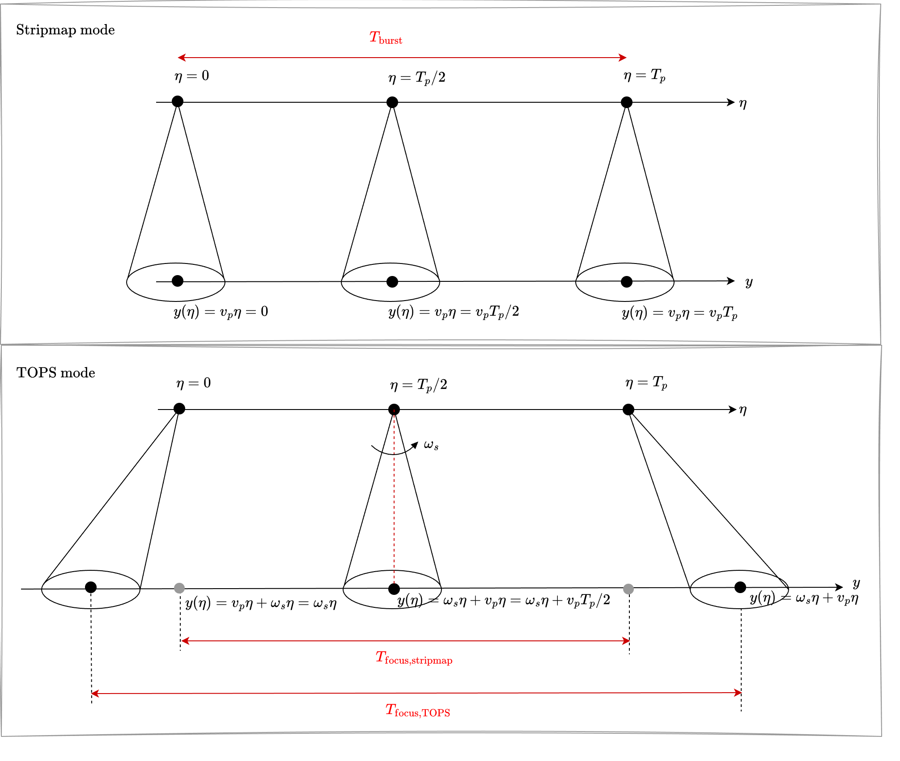

# TOPS SAR Derivations

## Flowchart

- [Raw Data](#1-raw-data)
- [Range Compression](#2-range-compression)
- [Azimuth Frequency Unfolding And Resampling (UFR)](#3-azimuth-frequency-unfolding-and-resampling-ufr)
  - [Azimuth Frequency Folding (Explain)](#31-azimuth-frequency-folding-explain)
  - [Mosaicking](#32-mosaicking)
  - [Deramping](#33-deramping)
  - [Low Pass Filter](#34-low-pass-filter)
  - [Reramping](#35-reramping)
- [Azimuth Compression](#4-azimuth-compression)
- [Azimuth Time Unfolding And Resampling (UFR)](#5-azimuth-time-unfolding-and-resampling-ufr)
  - [Azimuth Time Folding (Explain)](#51-azimuth-time-folding-explain)
  - [Mosaicking](#52-mosaicking)
  - [Deramping](#53-deramping)
  - [Low Pass Filter](#54-low-pass-filter)
  - [Reramping](#55-reramping)
- [Focused Image](#6-focused-image)

## Hierarchy

- [Summary](#summary)
- [Signal Definitions](#signal-definitions)
- [Problem Definition](#problem-definition)
- [Derivation Highlights](#derivation-highlights)
- [Symbols And Assumptions](#symbols-and-assumptions)
- Main Flow
  - [1. Raw Data](#1-raw-data)
  - [2. Range Compression](#2-range-compression)
  - [3. Azimuth Frequency Unfolding And Resampling (UFR)](#3-azimuth-frequency-unfolding-and-resampling-ufr)
    - [3.1. Azimuth Frequency Folding (Explain)](#31-azimuth-frequency-folding-explain)
  - [4. Azimuth Compression](#4-azimuth-compression)
  - [5. Azimuth Time Unfolding And Resampling (UFR)](#5-azimuth-time-unfolding-and-resampling-ufr)
    - [5.1. Azimuth Time Folding (Explain)](#51-azimuth-time-folding-explain)
  - [6. Focused Image](#6-focused-image)
- [Physical Meaning](#physical-meaning)
- [Final Result](#final-result)

## Problem Definition

本文件要把 TOPS SAR 的方位向處理鏈完整寫成一條顯式數學主線，並且回答以下幾個問題：

1. 如何以數學形式證明 azimuth frequency folding (aliasing) 的來源與其機制
2. 如何以數學形式說明 mosaicking 所執行的重排操作
3. 如何以數學形式證明 deramping 對主 replica phase curvature 的影響
4. 如何以數學形式證明 azimuth time folding (aliasing) 的來源與其機制

## Summary

- 這份推導把 TOPS SAR 的完整訊號 從 raw data 一路推到 focused image。
- 每一個 stage signal 都必須寫成自己的 fully expanded closed form，不能只用操作符代替。
- 對應的主鏈訊號依序為 $s_0(\tau,\eta)$ 、 $s_1(\tau,\eta)$ 、 $S_2(\tau,f_\eta)$ 、 $S_3(\tau,f_\eta)$ 、 $S_4(\tau,f_\eta)$ 、 $S_5(\tau,f_\eta)$ 、 $S_6(\tau,f_\eta)$ 、 $s_7(\tau,\eta)$ 、 $I_8(\tau,\eta)$ 、 $I_9(\tau,\eta)$ 、 $I_{10}(\tau,\eta)$ 、 $I_{11}(\tau,\eta)$ 與 $I_{\mathrm{focus}}(\tau,\eta)$ 。

## Signal Definitions

- $s_0(\tau,\eta)$ ： raw data
- $s_1(\tau,\eta)$ ： range-compressed data
- $S_2(\tau,f_\eta)$ ： folded azimuth-frequency signal
- $S_3(\tau,f_\eta)$ ： mosaicked azimuth-frequency signal
- $S_4(\tau,f_\eta)$ ： frequency-domain deramped signal
- $S_5(\tau,f_\eta)$ ： frequency-domain LPF output
- $S_6(\tau,f_\eta)$ ： frequency-domain reramped output
- $s_7(\tau,\eta)$ ： azimuth-compressed output
- $I_8(\tau,\eta)$ ： mosaicked azimuth-time signal
- $I_9(\tau,\eta)$ ： time-domain deramped signal
- $I_{10}(\tau,\eta)$ ： time-domain LPF output
- $I_{11}(\tau,\eta)$ ： time-domain reramped output
- $I_{\mathrm{focus}}(\tau,\eta)$ ： focused image

## Symbols And Assumptions

- $\tau$ ： range fast time
- $\eta$ ： azimuth slow time
- $f_\eta$ ： azimuth frequency
- $R(\eta)=\sqrt{R_0^2+V_r^2(\eta-\eta_0)^2}$ ： 瞬時斜距
- $K_r$ ： range chirp rate
- $B_r$ ： range bandwidth
- $T_r$ ： range pulse duration
- $T_p=1/\mathrm{PRF}$ ： slow-time sampling interval
- $f_{\eta_c}$ ： reference slow time $\eta_c$ 對應的 azimuth frequency
- $k_s$ ： frequency-domain local chirp slope，滿足 $f_\eta = k_s\eta + f_{\eta_c}$
- $k_t$ ： time-domain local chirp slope，滿足 $f_\eta(\eta)=k_t(\eta-\eta_c)+f_{\eta_c}$
- $w_a(\eta;\omega_s)$ ： TOPS azimuth illumination
- $W_a(f_\eta;\omega_s)$ ： 其 azimuth-frequency envelope
- $\psi_m(f_\eta)$ ： frequency-UFR 中第 $m$ 個 replica 的 phase
- $\chi_m(\eta)$ ： time-UFR 中第 $m$ 個 replica 的 phase
- $f_{\mathrm{LPF}}$ ： frequency-domain LPF keep window center frequency（通常對準主 replica 中心）
- $B_{\mathrm{LPF}}$ ： frequency-domain LPF keep window bandwidth
- $T_{\mathrm{LPF}}$ ： time-UFR keep window
- $B_{\mathrm{az,keep}}$ ： 最終保留的 azimuth effective bandwidth

## 1. Raw Data

The received signal of TOPS SAR is:

$$
s_0(\tau,\eta) = A_0\,
\mathrm{rect}\biggl( \frac{\tau-\frac{2R(\eta)}{c}}{T_r} \biggr)\cdot w_a(\eta;\omega_s)\cdot
\exp\biggl[ +j\pi K_r\biggl( \tau-\frac{2R(\eta)}{c} \biggr)^2 \biggr]\cdot \exp\biggl[ -j\frac{4\pi f_0R(\eta)}{c} \biggr]\cdot
{\color{red}{\sum_{n=-\infty}^{\infty}\delta(\eta-nT_p)}}
$$

- $\sum_{n=-\infty}^{\infty}\delta(\eta-nT_p)$
此式為 slow-time 上的 impulse train，將連續的 slow-time 訊號，以 $T_p$ 的時間間隔進行取樣。
- 新增此項，是為了後續用數學證明 azimuth frequency folding 是由取樣及 azimuth FFT 所造成。

## 2. Range Compression

此段落完整推導可參考 [range_compression.md](./range_compression.md)

Range matched filter 為

$$ h_r(\tau) = \exp\biggl( -j\pi K_r\tau^2 \biggr) $$

After range compression, we obtain

$$
s_1(\tau,\eta) = A_1\,
\mathrm{sinc}\biggl[ B_r\biggl( \tau-\frac{2R(\eta)}{c} \biggr) \biggr]\cdot w_a(\eta;\omega_s)\cdot
\exp\biggl[ -j\frac{4\pi f_0R(\eta)}{c} \biggr]\cdot
{\color{red}{\sum_{n=-\infty}^{\infty}\delta(\eta-nT_p)}}
$$

## 3. Azimuth Frequency Unfolding And Resampling (UFR)

此段落完整推導可參考 [Azimuth Frequency Folding](./azimuth_freq_folding.md)

### 3.1. Azimuth Frequency Folding (Explain)

#### 做完range compression的訊號可表示成

$$
s_1(\tau,\eta) = A_1\,
\mathrm{sinc}\biggl[ B_r\biggl( \tau-\frac{2R(\eta)}{c} \biggr) \biggr]\cdot w_a(\eta;\omega_s)\cdot
\exp\biggl( -j\frac{4\pi f_0R(\eta)}{c} \biggr)\cdot
{\color{red}{\sum_{n=-\infty}^{\infty}\delta(\eta-nT_p)}}
$$

$$ s_1(\tau,\eta) = s_{1,\mathrm{cont}}(\tau,\eta)\cdot \sum_{n=-\infty}^{\infty}\delta(\eta-nT_p) $$

- 其中 $s_{1,\mathrm{cont}}(\tau,\eta) = A_1\,
\mathrm{sinc}\biggl[ B_r\biggl( \tau-\frac{2R(\eta)}{c} \biggr) \biggr]\cdot w_a(\eta;\omega_s)\cdot
\exp\biggl[ -j\frac{4\pi f_0R(\eta)}{c} \biggr]$
- 也就是說， $s_{1,\mathrm{cont}}(\tau,\eta)$ 是連續訊號，而 $s_1(\tau,\eta)$ 則是透過 impulse train 取樣後得到的訊號。

#### Azimuth FFT

- 先對連續訊號 $s_{1,\mathrm{cont}}(\tau,\eta)$ 在 azimuth 方向做 Fourier transform：

$$ S_{1,c}(\tau,f_\eta;\omega_s) = \mathcal{F}_{\eta}\biggl[ s_{1,\mathrm{cont}}(\tau,\eta) \biggr] $$

$$
= A_2\,
\mathrm{sinc}\biggl[ B_r\biggl( \tau-\frac{2R_0}{cD(f_\eta,V_r)} \biggr) \biggr]\cdot W_a(f_\eta;\omega_s)\cdot
\exp\biggl[-j\phi_{az}(f_\eta)\biggr]
$$

- 其中， $\phi_{az}(f_\eta) = \frac{4\pi R_0f_0}{c}D(f_\eta,V_r)+2\pi f_\eta\eta_0$

- 其中， $W_a(f_\eta;\omega_s) = \mathcal{F}_{\eta}\biggl[ w_a(\eta;\omega_s) \biggr]$ 互為 Fourier pair

- 下一步再將 slow-time sampling 的效果帶進 frequency domain。由於 $s_1(\tau,\eta)$ 是 continuous signal 與 impulse train 的乘積，因此其 azimuth Fourier transform 可逐步寫成

$$ S_{2}(\tau,f_\eta) = \mathcal{F}_{\eta}\biggl[ s_{1,\mathrm{cont}}(\tau,\eta)\cdot \sum_{n=-\infty}^{\infty}\delta(\eta-nT_p) \biggr] $$

$$ = \mathcal{F}_{\eta}\biggl[ s_{1,\mathrm{cont}}(\tau,\eta) \biggr]\ast \mathcal{F}_{\eta}\biggl[ \sum_{n=-\infty}^{\infty}\delta(\eta-nT_p) \biggr] $$

$$ = S_{1,c}(\tau,f_\eta;\omega_s)\ast \biggl[ \mathrm{PRF}\sum_{k=-\infty}^{\infty}\delta(f_\eta-k\cdot\mathrm{PRF}) \biggr] $$

$$ = \mathrm{PRF}\sum_{k=-\infty}^{\infty} S_{1,c}(\tau,f_\eta-k\cdot\mathrm{PRF};\omega_s) $$

- $S_{2}(\tau,f_\eta)$ 是以 `PRF` 為間隔展開並加總之後得到的 folded azimuth-frequency spectrum.

- 其中，第 $k$ 個 replica 的 azimuth phase 寫成

$$ \phi_k(f_\eta) = \frac{4\pi R_0f_0}{c}D(f_\eta-k\cdot\mathrm{PRF},V_r) + 2\pi(f_\eta-k\cdot\mathrm{PRF})\eta_0 $$

- 下一步把上式中的 $S_{1,c}$ 完整展開之後，可寫成

$$
S_2(\tau,f_\eta) = \mathrm{PRF}\sum_{k=-\infty}^{\infty} A_2\,
\mathrm{sinc}\biggl[ B_r\biggl( \tau-\frac{2R_0}{cD(f_\eta-k\cdot\mathrm{PRF},V_r)} \biggr) \biggr]\cdot
W_a(f_\eta-k\cdot\mathrm{PRF};\omega_s)\cdot \exp\biggl[-j\phi_k(f_\eta)\biggr]
$$

- $n$ 是 slow-time sample index，滿足 $\eta=nT_p$ ，做完 azimuth FFT 之後， $n$ 不再顯式出現；其取樣效果改以頻域中每隔 `PRF` 出現的 spectral replicas表示。
- 因此後續以 $k$ 表示第 $k$ 個 folded spectral replica 
- $f_\eta-k\cdot\mathrm{PRF}$ 表示連續 azimuth spectrum 以 `PRF` 為間隔做平移後所得到的第 $k$ 個 spectral replica，也就是第 $k$ 個 folded copy。

#### Azimuth folded spectrum 的來源

- 這些 folded copies 的來源，是 slow-time 上的離散取樣 $\sum_{n=-\infty}^{\infty}\delta(\eta-nT_p)$ 在做 azimuth FFT 之後，於 frequency domain 變成一個以 `PRF` 為間隔的 impulse train，因而使原本的連續 spectrum $S_{1,c}$ 被週期性複製。

$$
{\color{red}{\mathcal{F}_{\eta}\biggl[ \sum_{n=-\infty}^{\infty}\delta(\eta-nT_p) \biggr] = 
\biggl[ \mathrm{PRF}\sum_{k=-\infty}^{\infty}\delta(f_\eta-k\cdot\mathrm{PRF}) \biggr]}}
$$

- 而 folding 可以從下面這個式子直接看出來：

$$ W_{\mathrm{fold}}(f_\eta;\omega_s) = \sum_{k=-\infty}^{\infty} W_a(f_\eta-k\cdot\mathrm{PRF};\omega_s) $$

- 其中 $W_a(f_\eta;\omega_s) \approx \mathrm{sinc}^2\biggl[ \frac{L_a}{\lambda}\biggl( -\frac{\lambda}{2V_r}f_\eta - \omega_s\biggl( \eta_0-\frac{\lambda R_0}{2V_r^2}f_\eta \biggr) \biggr) \biggr]$ 若要看這一步的完整推導，可直接參考 [azimuth_freq_folding.md](./azimuth_freq_folding.md)。

### 3.2. Mosaicking

此段落完整推導可參考 ： [azimuth_freq_ufr.md](./azimuth_freq_ufr.md)

#### Mosaicking 的核心概念

- Mosaicking 的核心是把 $S_2(\tau,f_\eta)$ 中原本 folded 在同一個基本頻帶內的 replicas，重新排到 extended azimuth-frequency axis 上。

#### 連續數學表示

- 先把 mosaicked signal 寫成 replica summation：

$$
{\color{red}{S_3(\tau,f_\eta)=\sum_{m=-N_{s,\mathrm{neg}}}^{N_{s,\mathrm{pos}}}S_{3,m}(\tau,f_\eta)}}
$$

- 其中，$S_2 \rightarrow S_{3,m} \rightarrow S_3$ 的連接可明確寫成以下三步：

1) 先從 folded spectrum $S_2$ 取出第 $m$ 個 replica 項

$$
S_2(\tau,f_\eta^{\mathrm{fold}})
= \mathrm{PRF}\sum_{k=-\infty}^{\infty}S_{1,c}\biggl(\tau,f_\eta^{\mathrm{fold}}-k\cdot\mathrm{PRF}\biggr)
$$

$$
S_2^{(m)}(\tau,f_\eta^{\mathrm{fold}})
:= \mathrm{PRF}\,S_{1,c}\biggl(\tau,f_\eta^{\mathrm{fold}}-m\cdot\mathrm{PRF}\biggr)
$$

2) 再把座標從 folded axis 重新解釋到 extended axis

$$
f_\eta^{\mathrm{ext}}=f_\eta^{\mathrm{fold}}+m\cdot\mathrm{PRF}
$$

$$
\widetilde S_{3,m}(\tau,f_\eta^{\mathrm{ext}})
:= S_2^{(m)}\biggl(\tau,f_\eta^{\mathrm{ext}}-m\cdot\mathrm{PRF}\biggr)
$$

3) 最後乘上第 $m$ 個 support mask 並對 $m$ 加總

$$
S_{3,m}(\tau,f_\eta^{\mathrm{ext}})
= \widetilde S_{3,m}(\tau,f_\eta^{\mathrm{ext}})\cdot
\mathrm{rect}\biggl(\frac{f_\eta^{\mathrm{ext}}-m\cdot\mathrm{PRF}-f_{\eta_c}}{B_{\max}}\biggr)
$$

- 這裡的 $\mathrm{rect}(\cdot)$ 是第 $m$ 個 replica 在 extended axis 上的 support mask（指示函數），不是新增的物理訊號項。
- 其作用是只保留該 replica 對應頻帶，頻帶外令為 0，避免不同 replicas 在拼接時互相混疊。

$$
S_3(\tau,f_\eta^{\mathrm{ext}})=\sum_m S_{3,m}(\tau,f_\eta^{\mathrm{ext}})
$$

- 為了凸顯 mosaicking 的分帶重排，以下採用
$$
W_a(f_\eta-m\cdot\mathrm{PRF};\omega_s)\approx
\mathrm{rect}\biggl(\frac{f_\eta-m\cdot\mathrm{PRF}-f_{\eta_c}}{B_{\max}}\biggr)
$$
作為有效 support 的近似表示。

- 以下為同一件事的 closed-form 寫法（為了簡潔，後續省略 ext/fold 上標，統一寫成 $f_\eta$）：

$$
S_{3,m}(\tau,f_\eta)=A_3\,
\mathrm{sinc}\biggl[B_r\biggl(\tau-\frac{2R_0}{c\,D_m(f_\eta)}\biggr)\biggr]\cdot
\mathrm{rect}\biggl(\frac{f_\eta-m\cdot\mathrm{PRF}-f_{\eta_c}}{B_{\max}}\biggr)\cdot
\exp\biggl[-j\phi_m(f_\eta)\biggr]
$$

$$
\phi_m(f_\eta)=\frac{4\pi R_0f_0}{c}D(f_\eta-m\cdot\mathrm{PRF},V_r)+2\pi(f_\eta-m\cdot\mathrm{PRF})\eta_0
$$

#### 重排原理與實作對應

- 在 $S_2(\tau,f_\eta)$ 中，$f_\eta$ 仍是 folded frequency axis 上的座標；到 $S_3(\tau,f_\eta)$ 時，$f_\eta$ 必須重新解釋成 extended axis 上的座標。
- mosaicking 的本質是先依 replica index 重新指定 extended-axis 座標，再做組裝。
- 其中 $m$ 表示第 $m$ 個 mosaicked replica；$m$ 同時決定該 replica 在 extended axis 上的頻率位移（以 `PRF` 為間隔）與 support 位置。

- 在 code 實作上，可直接依照 extended frequency index 重排，將各 replica 的 $(\tau,f_\eta)$ sub-matrix 重新排列並組裝成較大的 matrix。
- 這個 matrix assembly 能成立的原因是：每個 sub-matrix 對應的 $f_\eta$ 已先映射到 extended axis，而非沿用 folded 解釋。

### 3.3. Deramping

#### 起點：主 replica 的局部相位模型

- Deramping 的目標是消除主 replica 的 quadratic phase curvature，讓後續 LPF 可用固定頻帶視窗保留主能量。
- 因此先取主 replica $m_0$，在 reference frequency $f_{\eta_c}$ 附近做 Taylor 展開（局部工作頻帶近似）：

$$
\phi_{m_0}(f_\eta)\approx
\phi_{0,\mathrm{main}}+\phi_{1,\mathrm{main}}(f_\eta-f_{\eta_c})+\frac{1}{2}\phi_{2,\mathrm{main}}(f_\eta-f_{\eta_c})^2
$$

#### 二次係數 $\phi_{2,\mathrm{main}}$ 的來源

- $\phi_{2,\mathrm{main}}$ 不是新假設，而是 3.2 的 $\phi_m(f_\eta)$ 在 $f_{\eta_c}$ 的二階導數：

$$
\phi_{2,\mathrm{main}} = \biggl.\frac{d^2\phi_{m_0}(f_\eta)}{df_\eta^2}\biggr|_{f_\eta=f_{\eta_c}}
$$

$$
\phi_m(f_\eta)=\frac{4\pi R_0f_0}{c}D(f_\eta-m\cdot\mathrm{PRF},V_r)+2\pi(f_\eta-m\cdot\mathrm{PRF})\eta_0
$$

$$
\Rightarrow\;
\phi_{2,\mathrm{main}} =
\frac{4\pi R_0f_0}{c}
\biggl.
\frac{d^2}{df_\eta^2}D(f_\eta-m_0\cdot\mathrm{PRF},V_r)
\biggr|_{f_\eta=f_{\eta_c}}
$$

- 若本文不展開 $D''(\cdot)$ 的解析式，也可用一般 RDA 的 closed-form 二次相位來識別主項形式：
$$
S_{\mathrm{main}}(f_\eta)\propto
\exp\biggl[-j\frac{\pi}{K_a}(f_\eta-f_{\eta_c})^2\biggr]
$$
因此主 replica 的二次係數可等價寫成 $\pi/K_a$（符號正負依 Fourier sign convention 而定）。

#### Deramping filter 為何是這個形式

- 在本節定義
$$
\pi\frac{1}{k_s}:=\frac{1}{2}\phi_{2,\mathrm{main}}
$$
- 等價於 $k_s=2\pi/\phi_{2,\mathrm{main}}$。若採上述 RDA 記號，則可視為 $k_s\equiv K_a$（或差一個符號）。

主 replica phase 可重寫為
$$
\phi_{\mathrm{main}}(f_\eta)=\phi_{0,\mathrm{main}}+\phi_{1,\mathrm{main}}(f_\eta-f_{\eta_c})+\pi\frac{1}{k_s}(f_\eta-f_{\eta_c})^2
$$

為了對消上式的 quadratic term，frequency-domain deramping filter 設計為

$$
{\color{red}{H_{\mathrm{de},f}(f_\eta)=\exp\biggl(+j\pi\frac{1}{k_s}(f_\eta-f_{\eta_c})^2\biggr)}}
$$

#### Cancellation 與 Time-Frequency 拉直

主 replica 經過 deramping 後有

$$
\exp\biggl(-j\phi_{\mathrm{main}}(f_\eta)\biggr)\,H_{\mathrm{de},f}(f_\eta) =
\exp\biggl(-j\biggl[\phi_{0,\mathrm{main}}+\phi_{1,\mathrm{main}}(f_\eta-f_{\eta_c})\biggr]\biggr)
$$

$$
{\color{red}{\phi_{\mathrm{after}}(f_\eta)=\phi_{0,\mathrm{main}}+\phi_{1,\mathrm{main}}(f_\eta-f_{\eta_c})}}
$$

- 上式顯示主 replica 的 quadratic term 完全 cancellation，僅剩常數與線性項。
- 由
$$
\tau_g(f_\eta)\propto\frac{d\phi(f_\eta)}{df_\eta}
$$
可知：補償前 $\tau_g$ 隨 $f_\eta$ 變化（有 curvature）；補償後 $d^2\phi_{\mathrm{after}}/df_\eta^2=0$，主能量脊線被拉直（圖上可表現為近水平或近垂直，取決於座標軸定義）。
- 這就是後續 3.4 可以用固定 LPF 視窗保留主 replica 的原因。

#### Deramped 頻譜表達式

$$
S_4(\tau,f_\eta) = \sum_{m=-N_{s,\mathrm{neg}}}^{N_{s,\mathrm{pos}}} A_4\,
\mathrm{sinc}\biggl[ B_r\biggl( \tau-\frac{2R_0}{c\,D_m(f_\eta)} \biggr) \biggr]\cdot \mathrm{rect}\biggl( \frac{f_\eta-m\cdot\mathrm{PRF}-f_{\eta_c}}{B_{\max}} \biggr)\cdot
\exp\biggl( -j\biggl[ \psi_{0,m}+\psi_{1,m}(f_\eta-f_{\mathrm{ref}})+\psi_{2,m}(f_\eta-f_{\mathrm{ref}})^2 \biggr] \biggr)\cdot
\exp\biggl( +j\pi\frac{1}{k_s}(f_\eta-f_{\eta_c})^2 \biggr)
$$

- 上式中的 deramping filter 以主 replica 為 reference 設計，因此主項被完全拉直；非主 replicas 一般仍會保留殘餘二次項。

這一段若要看更完整的 phase-model、deramping 與 LPF 銜接細節，可直接看
[azimuth_deramp_LPF.md](./azimuth_deramp_LPF.md)。

### 3.4. Low Pass Filter

#### Frequency-Domain LPF 視窗

frequency-domain keep window 為

$$
H_{\mathrm{LPF},f}(f_\eta)=\mathrm{rect}\biggl(\frac{f_\eta-f_{\mathrm{LPF}}}{B_{\mathrm{LPF}}}\biggr)
$$

- 其中 $f_{\mathrm{LPF}}$ 是 keep window 的中心頻率，$B_{\mathrm{LPF}}$ 是 keep window 的頻寬。

#### FFT-based 實作與保留主項

- 在 FFT-based LPF 實作中，等價於在頻域 bins 上套用固定 keep window。
- 當視窗中心對準 deramped 主 replica 且 $B_{\mathrm{LPF}}$ 選得足夠窄（相對 replica 間距 `PRF`），則主要保留 $m=m_0$（通常可取 $m_0=0$）附近能量，$m\neq m_0$ 項被抑制。

$$
f_{\mathrm{LPF}}\approx 0
$$

$$
B_{\mathrm{LPF}}\approx B_{\mathrm{doppler}}
$$

因此 $B_{\mathrm{LPF}}<\mathrm{PRF}$，可避免同時納入相鄰 replicas（間距約為 `PRF`）。

#### 完整輸出式（保留多 replica 表示）

$$
S_5(\tau,f_\eta) = \sum_{m=-N_{s,\mathrm{neg}}}^{N_{s,\mathrm{pos}}} A_5\,
\mathrm{sinc}\biggl[ B_r\biggl( \tau-\frac{2R_0}{c\,D_m(f_\eta)} \biggr) \biggr]\cdot \mathrm{rect}\biggl( \frac{f_\eta-f_{\mathrm{LPF}}}{B_{\mathrm{LPF}}} \biggr)\cdot
\mathrm{rect}\biggl( \frac{f_\eta-m\cdot\mathrm{PRF}-f_{\eta_c}}{B_{\max}} \biggr)\cdot \exp\biggl( -j\biggl[ \psi_{0,m}+\psi_{1,m}(f_\eta-f_{\mathrm{ref}})+\psi_{2,m}(f_\eta-f_{\mathrm{ref}})^2 \biggr] \biggr)\cdot
\exp\biggl( +j\pi\frac{1}{k_s}(f_\eta-f_{\eta_c})^2 \biggr)
$$

#### 單主 replica 近似式

當 LPF 主要只保留主帶時，可近似寫成

$$
S_5(\tau,f_\eta)\approx S_{4,m_0}(\tau,f_\eta)\,H_{\mathrm{LPF},f}(f_\eta)
$$

若 $m_0=0$ 且主項 deramping 後二次相位已近似消除，則可寫成

$$
S_5(\tau,f_\eta)\approx A_5\,
\mathrm{sinc}\biggl[B_r\biggl(\tau-\frac{2R_0}{c\,D_{m_0}(f_\eta)}\biggr)\biggr]\cdot
\mathrm{rect}\biggl(\frac{f_\eta-f_{\mathrm{LPF}}}{B_{\mathrm{LPF}}}\biggr)\cdot
\exp\biggl(-j\biggl[\psi_{0,m_0}+\psi_{1,m_0}(f_\eta-f_{\mathrm{ref}})\biggr]\biggr)
$$

#### 物理意義

- Deramping 先把主 replica 在 time-frequency 圖上的能量脊線拉直。
- LPF 再以固定頻帶視窗擷取這條主能量帶，達到「保主項、抑制旁瓣 replicas」的效果。

LPF 的完整理想模型與 FFT-based 實作，可直接看：
- [azimuth_deramp_LPF.md 第 4 節](./azimuth_deramp_LPF.md#4-ideal-lpf-model)
- [azimuth_deramp_LPF.md 第 5 節](./azimuth_deramp_LPF.md#5-fft-based-lpf-implementation)

### 3.5. Reramping

#### 為什麼要 Reramping

- 3.4 的 LPF 是在 deramped 座標下完成主帶選取；為了回到後續 azimuth compression 所需的 reference phase model，需把主項 curvature 乘回去。
- 因此 reramping 是 deramping 的共軛反操作，但只作用在 LPF 後保留的頻帶上。

#### Frequency-Domain Reramping Filter

$$
H_{\mathrm{re},f}(f_\eta)=\exp\biggl(-j\pi\frac{1}{k_s}(f_\eta-f_{\eta_c})^2\biggr)
$$

#### 完整輸出式（保留多 replica 表示）

$$
S_6(\tau,f_\eta) = \sum_{m=-N_{s,\mathrm{neg}}}^{N_{s,\mathrm{pos}}} A_6\,
\mathrm{sinc}\biggl[ B_r\biggl( \tau-\frac{2R_0}{c\,D_m(f_\eta)} \biggr) \biggr]\cdot \mathrm{rect}\biggl( \frac{f_\eta-f_{\mathrm{LPF}}}{B_{\mathrm{LPF}}} \biggr)\cdot
\mathrm{rect}\biggl( \frac{f_\eta-m\cdot\mathrm{PRF}-f_{\eta_c}}{B_{\max}} \biggr)\cdot
\exp\biggl( -j\biggl[ \psi_{0,m}+\psi_{1,m}(f_\eta-f_{\mathrm{ref}})+\psi_{2,m}(f_\eta-f_{\mathrm{ref}})^2 \biggr] \biggr)
$$

#### 單主 replica 近似式

當 LPF 已主要保留主項 $m_0$（通常 $m_0=0$）時，可近似寫成

$$
S_6(\tau,f_\eta)\approx S_{5,m_0}(\tau,f_\eta)\,H_{\mathrm{re},f}(f_\eta)
$$

$$
S_6(\tau,f_\eta)\approx A_6\,
\mathrm{sinc}\biggl[B_r\biggl(\tau-\frac{2R_0}{c\,D_{m_0}(f_\eta)}\biggr)\biggr]\cdot
\mathrm{rect}\biggl(\frac{f_\eta-f_{\mathrm{LPF}}}{B_{\mathrm{LPF}}}\biggr)\cdot
\exp\biggl(-j\biggl[\psi_{0,m_0}+\psi_{1,m_0}(f_\eta-f_{\mathrm{ref}})+\pi\frac{1}{k_s}(f_\eta-f_{\eta_c})^2\biggr]\biggr)
$$

#### 物理意義

- Deramping + LPF + Reramping 可理解為：先把主帶拉直以利固定視窗裁切，再把保留下來的主帶送回目標相位曲率座標。
- 因為 LPF 已抑制多數非主 replicas，reramping 後主要保留的是主項的有效頻譜，供下一步 azimuth compression 使用。

#### 小總結（到 $S_6$ 為止）

- 在「mosaicking $\rightarrow$ deramping $\rightarrow$ LPF $\rightarrow$ reramping」完成後，可近似視為只剩主頻帶 $m=0$（或一般記作 $m_0$）對應的有效頻譜。
- 目前式子中的 $\mathrm{rect}\biggl(\frac{f_\eta-f_{\mathrm{LPF}}}{B_{\mathrm{LPF}}}\biggr)$ 代表最終保留的主頻帶視窗；其他 replicas 因不在 keep window 內而被抑制。
- 目前主項 phase term 可理解為「常數項 + 線性項 + 被 reramping 乘回的目標二次曲率項」；它已回到後續 azimuth compression 可直接匹配的 phase 座標系。

## 4. Azimuth Compression

這一步的輸入承接 3.5 的 `S_6(tau,f_eta)`。3.2–3.5 的核心任務是把 folded replicas 解開並以 LPF 保留主頻帶，因此到這裡可直接採用 **`m=0` 主頻帶**（不再寫 replica summation）。

本節只保留 azimuth compression filter $H_{\mathrm{ac}}$ ；不另外展開 $H_{\mathrm{SRC}}$ 、 $H_{\mathrm{RCMC}}$ 。

定義

$$ H_{\mathrm{ac}}(f_\eta) = \exp\biggl(+j\frac{4\pi R_0}{\lambda}D(f_\eta)\biggr) $$

令 3.5 輸出的主頻帶等效式為

$$
S_{6,m=0}(\tau,f_\eta) \approx A_6\,
\mathrm{sinc}\biggl[B_r\biggl(\tau-\frac{2R_0}{cD(f_{dc})}\biggr)\biggr]\cdot
\mathrm{rect}\biggl(\frac{f_\eta-f_{dc}}{F_a}\biggr)\cdot
\exp\biggl(-j\frac{4\pi R_0}{\lambda}D(f_\eta)\biggr)\cdot
\exp\biggl(-j2\pi f_\eta\eta_c\biggr)
$$

乘上 $H_{\mathrm{ac}}$ 後，方位向主相位項對消：

$$
S_{6,\mathrm{ac}}(\tau,f_\eta) = S_{6,m=0}(\tau,f_\eta)\,H_{\mathrm{ac}}(f_\eta)
\approx A_7\,
\mathrm{sinc}\biggl[B_r\biggl(\tau-\frac{2R_0}{cD(f_{dc})}\biggr)\biggr]\cdot
\mathrm{rect}\biggl(\frac{f_\eta-f_{dc}}{F_a}\biggr)\cdot
\exp\biggl(-j2\pi f_\eta\eta_c\biggr)
$$

對 $f_\eta$ 做 IFFT，可得到標準 RDA 型式的 azimuth sinc 壓縮結果：

$$ s_7(\tau,\eta) \approx \mathcal{F}^{-1}_{f_\eta}\biggl\{S_{6,\mathrm{ac}}(\tau,f_\eta)\biggr\} $$

$$
\mathcal{F}^{-1}_{f_\eta} \biggl\{
\mathrm{rect}\biggl(\frac{f_\eta-f_{dc}}{F_a}\biggr)\exp(-j2\pi f_\eta\eta_c)
\biggr\} = F_a\,\mathrm{sinc}\biggl[F_a(\eta-\eta_c)\biggr]\,
\exp\biggl(j2\pi f_{dc}(\eta-\eta_c)\biggr)
$$

因此

$$
{\color{red}{s_7(\tau,\eta)\approx
A_7\,
\mathrm{sinc}\biggl[B_r\biggl(\tau-\frac{2R_0}{cD(f_{dc})}\biggr)\biggr]\cdot
F_a\,\mathrm{sinc}\biggl[F_a(\eta-\eta_c)\biggr]\cdot
\exp\biggl(j2\pi f_{dc}(\eta-\eta_c)\biggr)}}
$$

若使用有限長 FFT 而未做足夠 zero-padding，實作上仍可能出現 circular wrap-around；其完整數學推導與 replica 表示統一放在 5.1 之後處理。

## 5. Azimuth Time Unfolding And Resampling (UFR)

這一段主流程的前置現象推導是 [Azimuth Time Folding](./azimuth_time_folding.md) 。也就是先證明 finite-FFT 為什麼會把線性卷積折回成 time-domain wrap-around，再進入 $mosaicking \rightarrow deramping \rightarrow LPF \rightarrow reramping$ 的處理鏈。

### 5.1. Azimuth Time Folding (Explain)

先用最簡單的離散卷積例子看 wrap-around：

若線性卷積長度為

$$ L_{\mathrm{lin}} = N_x + N_h - 1 $$

但實作只用長度 $L$ 的 FFT（且 $L < L_{\mathrm{lin}}$ ），則 IFFT 得到的是 circular convolution：

$$ y_{\mathrm{circ}}[n] = \sum_{r=-\infty}^{\infty}y_{\mathrm{lin}}[n+rL] $$

這個式子的意思是：超出 $[0,L-1]$ 的線性卷積尾巴，會以週期 $L$ 折回到前面 index。  
例如 $L = 8$ 時，原本在線性卷積 index $n = 9$ 的能量，會折回到 $n = 1$ （因為 $9 = 1 + 1\cdot 8$ ）。

對應到 azimuth 軸，只要把離散 index 週期 $L$ 換成時間週期

$$ T_{\mathrm{window}} = \frac{N_a}{\mathrm{PRF}} $$

就得到 azimuth-time wrap-around 的同一件事。

上圖可用來理解為什麼 TOPS 會更容易出現 time folding：  
在 stripmap 中，天線主波束基本上跟著平台前進，目標被照亮的 slow-time 可近似視為平台飛行時間座標 $\eta$ 的局部區段，常寫成「 $\eta \leftrightarrow \eta'$ 幾乎同尺度」。

但在 TOPS 中，平台前進的同時波束還在方位向掃描（steering），因此目標的等效觀測時間軸 $\eta'$ 會被拉長；也就是說，在相同平台飛行時間跨度 $\eta$ 下，訊號在成像端需要覆蓋更長的有效時間支撐。

因此可寫成

$$ T_{\eta',\mathrm{TOPS}} > T_{\eta,\mathrm{platform}} $$

這正是後面 FFT 窗長不足時更容易產生 circular wrap-around 的幾何原因。

time-domain wrap-around 的核心式子是

$$ {\color{red}{I_{\mathrm{circ}}(\eta) = \sum_{m=-\infty}^{\infty} I_{\mathrm{lin}}(\eta-mT_{\mathrm{window}})}} $$

- $I_{\mathrm{lin}}(\eta)$ 是理想線性卷積結果。
- 有限長 FFT 實作得到的是週期延拓後的 $I_{\mathrm{circ}}(\eta)$ 。
- 超出主時間窗口的能量會以 $T_{\mathrm{window}}$ 週期折回，形成 azimuth-time folding。

因此本節後續的 time-UFR 鏈

$$ mosaicking \rightarrow deramping \rightarrow LPF \rightarrow reramping $$

本質上就是把這個折回項重新拆開、對齊、裁切，再回到目標相位座標。

若要看完整現象推導，可直接看
[azimuth_time_folding.md 的 circular convolution 式子](./azimuth_time_folding.md#6-circular-convolution-and-wrap-around)。

### 5.2. Mosaicking

Mosaicking 的目標是把原本在同一時間窗口內折回重疊的 replicas，重排到 extended azimuth-time axis。

先寫成分項再加總：

$$ I_8(\tau,\eta) = \sum_{m=-N_{t,\mathrm{neg}}}^{N_{t,\mathrm{pos}}} I_{8,m}(\tau,\eta) $$

$$
{\color{red}{I_{8,m}(\tau,\eta)=A_8\,
\mathrm{sinc}\biggl[ B_r\biggl( \tau-\frac{2R_0}{c} \biggr) \biggr]\cdot \mathrm{rect}\biggl( \frac{\eta-mT_{\mathrm{window}}-\eta_c}{T_{\mathrm{keep}}} \biggr)\cdot
\mathrm{sinc}\biggl[ B_{\mathrm{az},m}\biggl( \eta-mT_{\mathrm{window}}-\eta_c \biggr) \biggr]\cdot
\exp\biggl( -j\biggl[ \chi_{0,m}+\chi_{1,m}(\eta-\eta_{\mathrm{ref}})+\chi_{2,m}(\eta-\eta_{\mathrm{ref}})^2 \biggr] \biggr)}}
$$

其中

$$ \mathrm{rect}\biggl( \frac{\eta-mT_{\mathrm{window}}-\eta_c}{T_{\mathrm{keep}}} \biggr) $$

是第 $m$ 個 time replica 的 support window。
- 這一步之後，replicas 已不是重疊在同一主窗口，而是被索引 $m$ 清楚分離。

time-domain folding 與 wrap-around location 的完整說明可參考：
- [azimuth_time_folding.md 第 6 節](./azimuth_time_folding.md#6-circular-convolution-and-wrap-around)
- [azimuth_time_folding.md 第 7 節](./azimuth_time_folding.md#7-wrap-around-location-formula)

### 5.3. Deramping

Deramping 的目標是移除主 replica 的 chirp curvature，讓主能量在 time-frequency 圖上拉直，以利固定時間窗 LPF。

先把主項在 $\eta_c$ 附近寫成 reference chirp：

$$ \phi_{\mathrm{main}}(\eta) = \phi_{0,\mathrm{main}}+\pi k_t(\eta-\eta_c)^2+2\pi f_{\eta_c}\eta $$

對應的 time-domain deramping filter 定義為

$$ {\color{red}{H_{\mathrm{de},t}(\eta) = \exp\biggl( -j\pi k_t(\eta-\eta_c)^2 - j2\pi f_{\eta_c}\eta \biggr)}} $$

主項相位對消可寫成

$$ \exp\biggl( -j\phi_{\mathrm{main}}(\eta) \biggr)H_{\mathrm{de},t}(\eta) = \exp\biggl( -j\phi_{0,\mathrm{main}} \biggr) $$

$$ {\color{red}{\phi_{\mathrm{after}}(\eta) = \phi_{0,\mathrm{main}}}} $$

等價地看 instantaneous Doppler：

$$ f_{\eta,\mathrm{old}}(\eta) = k_t(\eta-\eta_c)+f_{\eta_c} $$

補償量為

$$ \Delta f_\eta(\eta) = -k_t(\eta-\eta_c)-f_{\eta_c} $$

因此

$$ {\color{red}{f_{\eta,\mathrm{new}}(\eta) = f_{\eta,\mathrm{old}}(\eta)+\Delta f_\eta(\eta) = 0}} $$

也就是主項由斜率 chirp 變成常數頻率帶；這就是後續 LPF 可以只保留主帶的原因。

若要看 frequency-domain 與 time-domain deramping 設計的完整對照，可直接看
[freq_time_deramping.md](./freq_time_deramping.md)。

time-domain deramped signal 可寫成

$$
I_9(\tau,\eta) = \sum_{m=-N_{t,\mathrm{neg}}}^{N_{t,\mathrm{pos}}} A_9\,
\mathrm{sinc}\biggl[ B_r\biggl( \tau-\frac{2R_0}{c} \biggr) \biggr]\cdot \mathrm{rect}\biggl( \frac{\eta-mT_{\mathrm{window}}-\eta_c}{T_{\mathrm{keep}}} \biggr)\cdot
\mathrm{sinc}\biggl[ B_{\mathrm{az},m}\biggl( \eta-mT_{\mathrm{window}}-\eta_c \biggr) \biggr]\cdot \exp\biggl( -j\biggl[ \chi_{0,m}+\chi_{1,m}(\eta-\eta_{\mathrm{ref}})+\chi_{2,m}(\eta-\eta_{\mathrm{ref}})^2 \biggr] \biggr)\cdot
\exp\biggl( -j\pi k_t(\eta-\eta_c)^2 - j2\pi f_{\eta_c}\eta \biggr)
$$

### 5.4. Low Pass Filter

time-domain keep window 定義為

$$ H_{\mathrm{LPF},t}(\eta) = \mathrm{rect}\biggl( \frac{\eta-\eta_{\mathrm{LPF}}}{T_{\mathrm{LPF}}} \biggr) $$

乘上 LPF 後

$$
I_{10}(\tau,\eta) = \sum_{m=-N_{t,\mathrm{neg}}}^{N_{t,\mathrm{pos}}} A_{10}\,
\mathrm{sinc}\biggl[ B_r\biggl( \tau-\frac{2R_0}{c} \biggr) \biggr]\cdot \mathrm{rect}\biggl( \frac{\eta-\eta_{\mathrm{LPF}}}{T_{\mathrm{LPF}}} \biggr)\cdot
\mathrm{rect}\biggl( \frac{\eta-mT_{\mathrm{window}}-\eta_c}{T_{\mathrm{keep}}} \biggr)\cdot \mathrm{sinc}\biggl[ B_{\mathrm{az},m}\biggl( \eta-mT_{\mathrm{window}}-\eta_c \biggr) \biggr]\cdot
\exp\biggl( -j\biggl[ \chi_{0,m}+\chi_{1,m}(\eta-\eta_{\mathrm{ref}})+\chi_{2,m}(\eta-\eta_{\mathrm{ref}})^2 \biggr] \biggr)\cdot
\exp\biggl( -j\pi k_t(\eta-\eta_c)^2 - j2\pi f_{\eta_c}\eta \biggr)
$$

- 當 $\eta_{\mathrm{LPF}}$ 對準主項且 $T_{\mathrm{LPF}}$ 小於 replica 間距時，主要保留 $m=m_0$ 附近能量。

### 5.5. Reramping

為了回到後續成像所需的 reference phase 座標，定義 reramping filter：

$$ H_{\mathrm{re},t}(\eta) = \exp\biggl( +j\pi k_t(\eta-\eta_c)^2 + j2\pi f_{\eta_c}\eta \biggr) $$

乘回後得到

$$
I_{11}(\tau,\eta) = \sum_{m=-N_{t,\mathrm{neg}}}^{N_{t,\mathrm{pos}}} A_{11}\,
\mathrm{sinc}\biggl[ B_r\biggl( \tau-\frac{2R_0}{c} \biggr) \biggr]\cdot \mathrm{rect}\biggl( \frac{\eta-\eta_{\mathrm{LPF}}}{T_{\mathrm{LPF}}} \biggr)\cdot
\mathrm{rect}\biggl( \frac{\eta-mT_{\mathrm{window}}-\eta_c}{T_{\mathrm{keep}}} \biggr)\cdot \mathrm{sinc}\biggl[ B_{\mathrm{az},m}\biggl( \eta-mT_{\mathrm{window}}-\eta_c \biggr) \biggr]\cdot
\exp\biggl( -j\biggl[ \chi_{0,m}+\chi_{1,m}(\eta-\eta_{\mathrm{ref}})+\chi_{2,m}(\eta-\eta_{\mathrm{ref}})^2 \biggr] \biggr)
$$

- 整體上，`deramping + LPF + reramping` 的作用可理解為：
  先把主項拉直以便裁切，再把保留主帶送回目標相位模型。

## 6. Focused Image

若只保留主 replica $m=m_0$ ，可得最終聚焦近似：

$$
{\color{red}{I_{\mathrm{focus}}(\tau,\eta) \approx A_f\,
\mathrm{sinc}\biggl[ B_r\biggl( \tau-\frac{2R_0}{c} \biggr) \biggr]\cdot
\mathrm{sinc}\biggl[ B_{\mathrm{az,keep}}(\eta-\eta_c) \biggr]}}
$$

## Physical Meaning

- $s_0 \rightarrow s_1$ ： 把 raw range chirp 變成 range-compressed pulse。
- $s_1 \rightarrow S_6$ ： 把 azimuth frequency folded replicas 攤開、展平、裁切，再補回 reference curvature。
- $S_6 \rightarrow s_7$ ： 做主聚焦。
- $s_7 \rightarrow I_{11}$ ： 把壓縮後 time-domain 的 replicas 再做一次 UFR。
- $I_{11} \rightarrow I_{\mathrm{focus}}$ ： 保留主 replica，得到 focused image。

## Final Result

$$
s_0(\tau,\eta)\rightarrow s_1(\tau,\eta)\rightarrow S_2(\tau,f_\eta)\rightarrow S_3(\tau,f_\eta)\rightarrow S_4(\tau,f_\eta)\rightarrow S_5(\tau,f_\eta)\rightarrow S_6(\tau,f_\eta)
$$

$$
\rightarrow s_7(\tau,\eta)\rightarrow I_8(\tau,\eta)\rightarrow I_9(\tau,\eta)\rightarrow I_{10}(\tau,\eta)\rightarrow I_{11}(\tau,\eta)\rightarrow I_{\mathrm{focus}}(\tau,\eta)
$$
