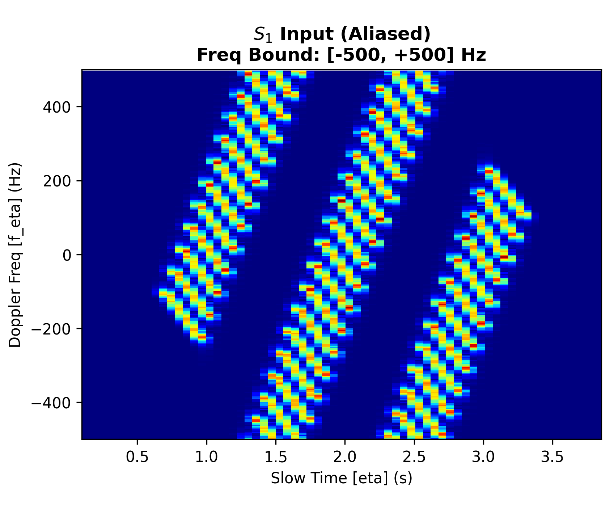
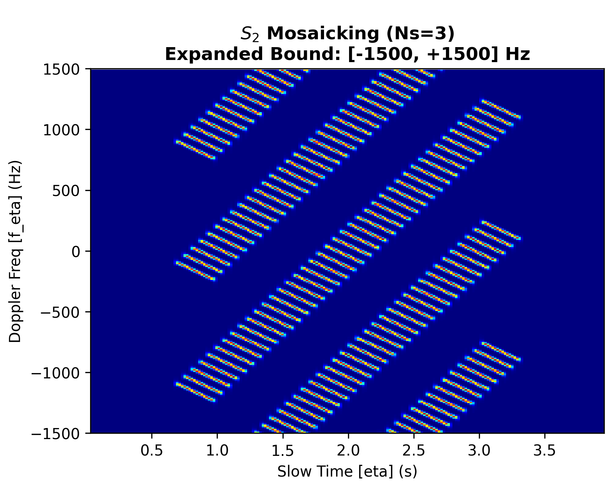
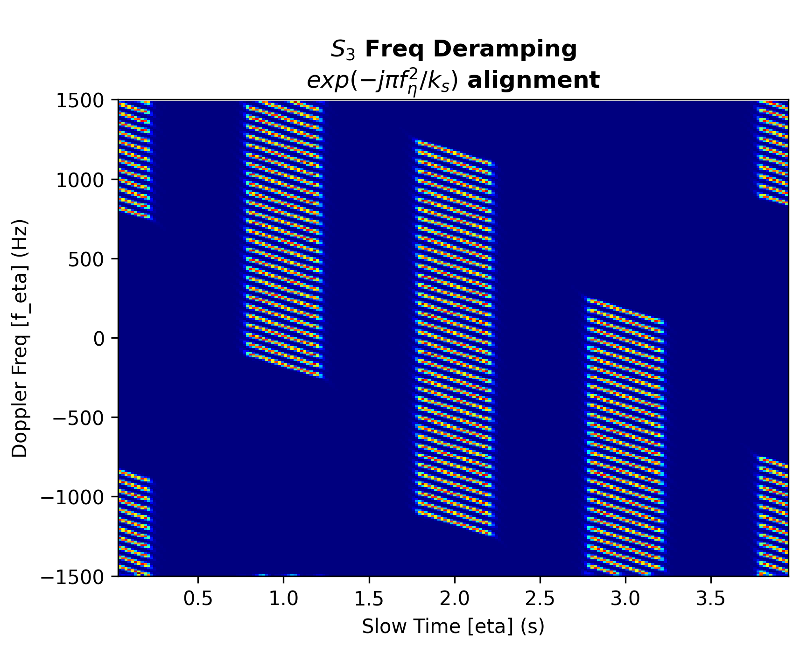
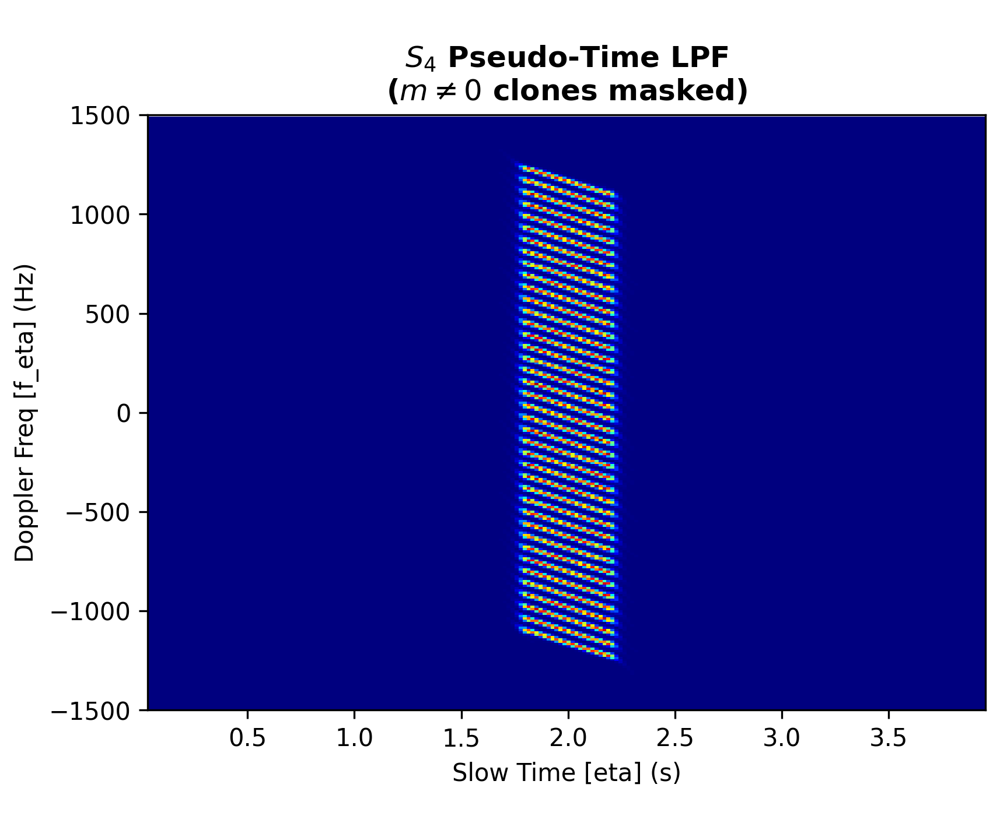
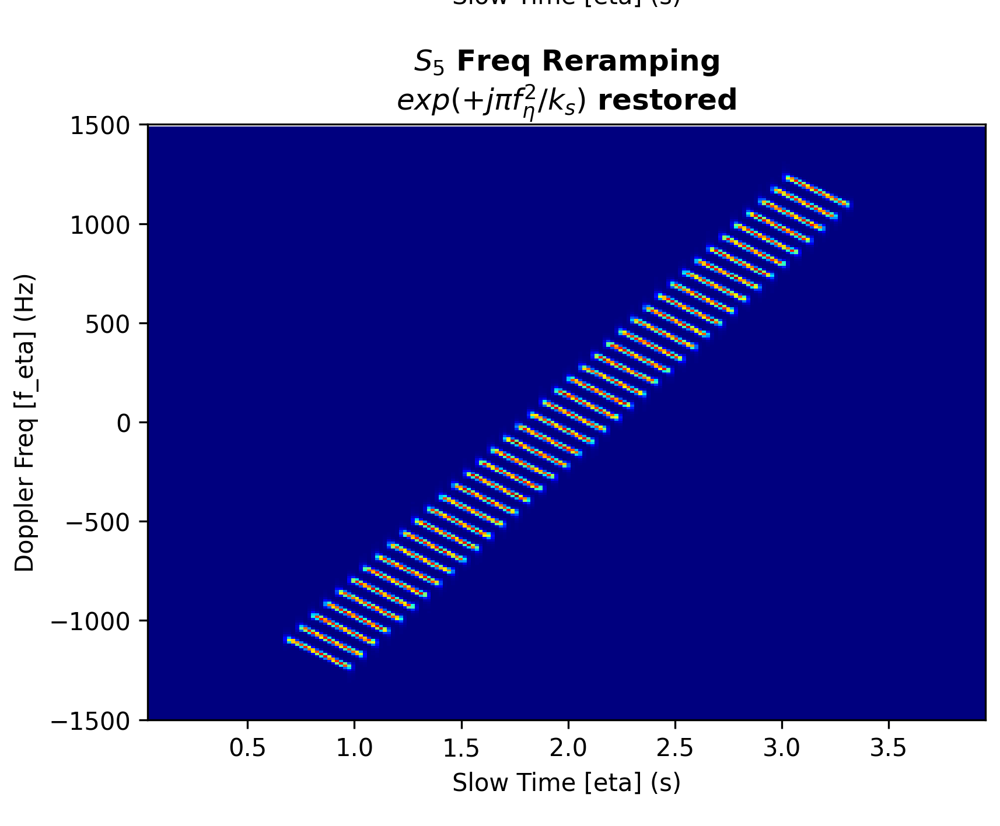
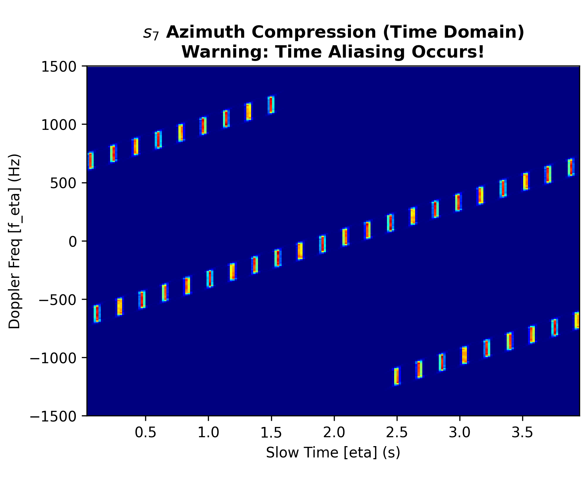
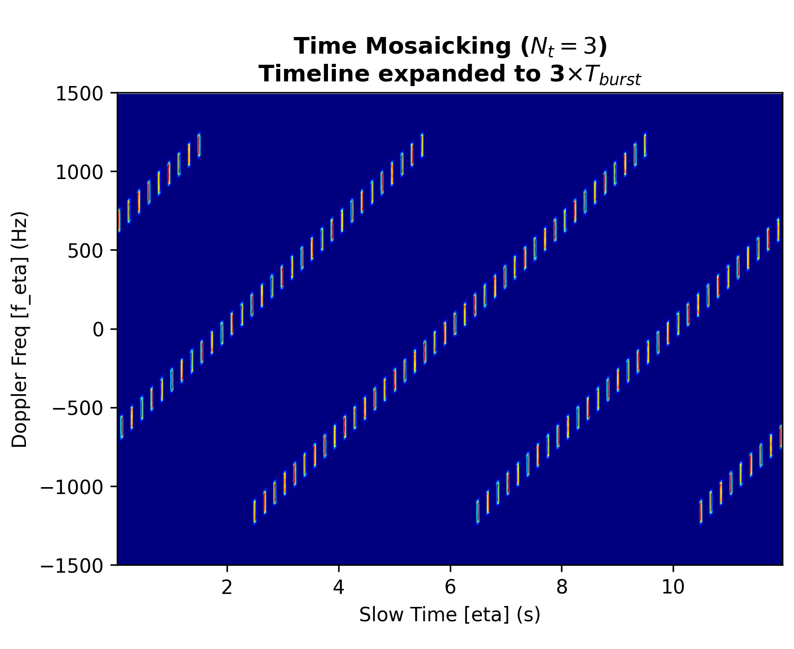
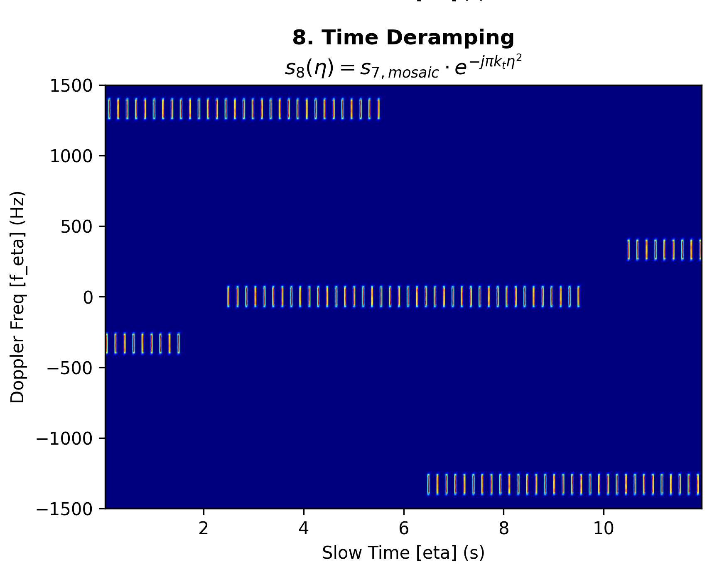
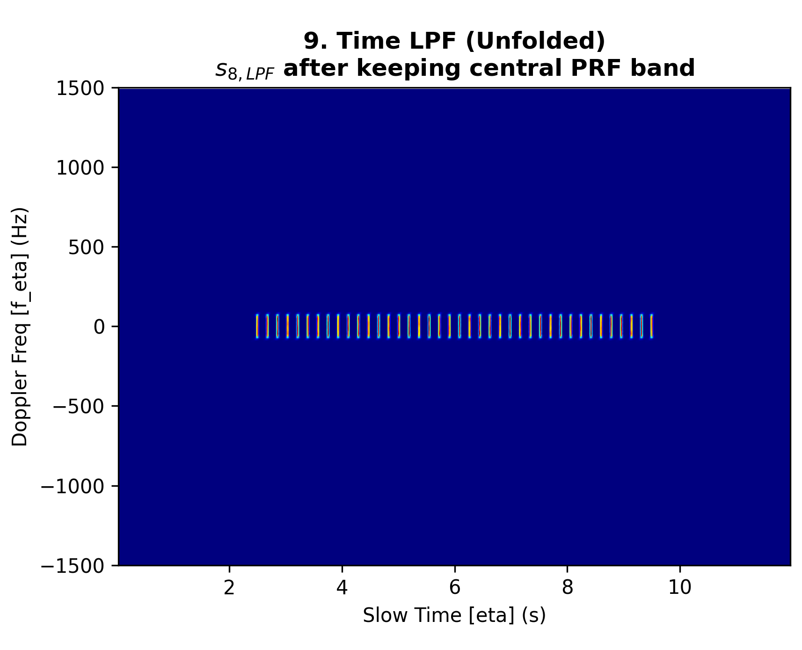
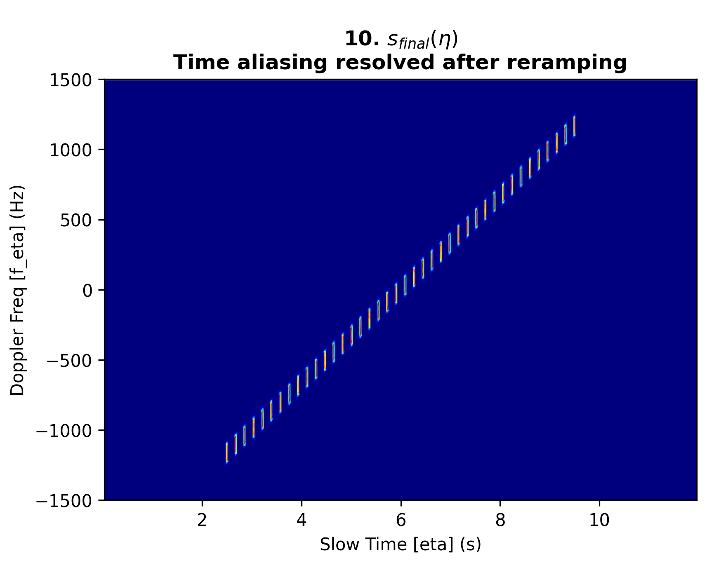

# Explain UFR3: TOPS Time-Frequency Flow

## Navigation

- [Overall](./tops_azimuth_overall.md)
- Related notes:
  - [Azimuth Frequency Folding](./azimuth_freq_folding.md)
  - [Azimuth Frequency UFR](./azimuth_freq_ufr.md)
  - [Azimuth Compression](./azimuth_compression.md)
  - [Azimuth Time UFR](./azimuth_time_ufr.md)
- Companion note: [Explain UFR4](./explain_ufr4.md)

## Table of Contents

- [Summary](#summary)
- [Problem Definition](#problem-definition)
- [Symbols And Assumptions](#symbols-and-assumptions)
- [1. Input Aliased Signal](#1-input-aliased-signal)
- [2. Frequency Mosaicking](#2-frequency-mosaicking)
- [3. Frequency Deramping](#3-frequency-deramping)
- [4. Pseudo-Time LPF](#4-pseudo-time-lpf)
- [5. Frequency Reramping](#5-frequency-reramping)
- [6. Azimuth Compression](#6-azimuth-compression)
- [7. Time Mosaicking](#7-time-mosaicking)
- [8. Time Deramping](#8-time-deramping)
- [9. Time LPF](#9-time-lpf)
- [10. Final Time Reramping](#10-final-time-reramping)
- [Final Result](#final-result)

## Summary

- `explain_UFR3.py` 用一維 azimuth signal 把 TOPS 的 `frequency UFR -> azimuth compression -> time UFR` 串成完整的 time-frequency diagram。
- 這份文件現在採用 `圖 -> 數學 -> 程式碼 -> 物理` 的 flow，因此每一張圖下面都能直接看到它對應的公式與實作。
- 這條主線依序經過 `s_1(eta) -> S_1(f_eta) -> S_2(f_eta) -> S_3(f_eta) -> S_4(f_eta) -> S_5(f_eta) -> s_7(eta) -> s_7_mosaic(eta) -> s_8(eta) -> s_8_unfolded(eta) -> s_final(eta)`。

## Problem Definition

本文件要回答三件事：

1. `explain_UFR3.py` 每一張圖對應哪一個 signal transform。
2. 每一個 stage 的 fully expanded closed form 是什麼。
3. 程式中的變數與數學符號如何嚴格一一對應。

## Symbols And Assumptions

- $\eta$：azimuth slow time
- `f_\eta`：azimuth frequency
- `T_{\mathrm{burst}}`：burst duration
- `\mathrm{PRF}`：azimuth sampling rate
- `N_{\mathrm{az}}=\mathrm{PRF}\cdot T_{\mathrm{burst}}`
- `k_a`：target azimuth FM rate
- `k_s`：scan-induced Doppler-centroid rate
- `T_{\mathrm{dwell}}`：illumination dwell time
- `t_c`：target focus-center label
- `t_{\mathrm{expo}}`：target exposure center
- `k_t=\frac{k_ak_s}{k_a-k_s}`：time-UFR chirp rate

## 1. Input Aliased Signal

<p align="center">
  
</p>

Figure Caption:
這張圖是原始輸入 `s_1(eta)` 的 time-frequency view。每條斜 chirp trace 代表一個目標的 azimuth phase history，而可見區域則由 illumination window 決定。

Mathematical Step:
$$
w_p(\eta) = \mathrm{rect}\left( \frac{\eta-t_{\mathrm{expo},p}}{T_{\mathrm{dwell}}} \right)
$$

$$
s_{1,p}(\eta) = w_p(\eta) \exp\left( j\pi k_a(\eta-t_{c,p})^2 \right)
$$

$$
\color{red}{ s_1(\eta) = \sum_p \mathrm{rect}\left( \frac{\eta-t_{\mathrm{expo},p}}{T_{\mathrm{dwell}}} \right) \exp\left( j\pi k_a(\eta-t_{c,p})^2 \right) }
$$

$$
\color{red}{ t_{\mathrm{expo},p} = \frac{k_a}{k_a-k_s} t_{c,p} }
$$
Code Mapping:

```python
raw_signal = np.zeros(Naz, dtype=complex)
tc_array = np.linspace(-3.5, 3.5, 40)
for tc in tc_array:
    t_expo = (ka / (ka - ks)) * tc
    window = np.abs(eta - t_expo) <= (T_dwell / 2)
    target_phase = np.exp(1j * np.pi * ka * (eta - tc) ** 2)
    raw_signal[window] += target_phase[window]
```

Physical Meaning:
TOPS 先改變的是目標被照亮的時刻，而不是直接改變 matched filter。這也是後面 folding 與 focused-time inflation 的源頭。

Why This Leads To The Next Figure:
對 `s_1(eta)` 做 FFT 之後，就進入原始 PRF 限制下的 aliased azimuth spectrum。

## 2. Frequency Mosaicking

<p align="center">
  
</p>

Figure Caption:
這張圖對應 `S_2(f_eta)`。它把 folded 在 principal band 內的 replicas 沿 extended frequency axis 攤開。

Mathematical Step:
$$
S_1(f_\eta) = \mathcal{F}_\eta\left[s_1(\eta)\right]
$$
$$
{\color{red}
S_2(f_\eta) =
\sum_{m=-1}^{1}
S_1(f_\eta-m\cdot\mathrm{PRF})
}
$$
Code Mapping:

```python
S1_aliased = np.fft.fftshift(np.fft.fft(raw_signal))
num_replicas = 3
S2 = np.tile(S1_aliased, num_replicas)
N_ufr = len(S2)
PRF_ufr = PRF * num_replicas
f_eta = np.linspace(-PRF_ufr / 2, PRF_ufr / 2, N_ufr, endpoint=False)
```

Physical Meaning:
這一步把原本疊在主頻帶內的 folded replicas 攤開，讓主 replica 可以被單獨處理。

Why This Leads To The Next Figure:
攤開之後，主 replica 的 quadratic curvature 才能被 frequency deramp 單獨展平。

## 3. Frequency Deramping

<p align="center">
  
</p>

Figure Caption:
這張圖對應 `S_3(f_eta)`。主 replica 經過 deramp 後，quadratic curvature 被展平。

Mathematical Step:
$$
{\color{red}
D_{\mathrm{de}}(f_\eta) =
\exp\left(
j\pi \frac{f_\eta^2}{k_s}
\right)
}
$$
$$
{\color{red}
S_3(f_\eta) = S_2(f_\eta)\,D_{\mathrm{de}}(f_\eta)
}
$$
Code Mapping:

```python
deramp_phase = np.exp(1j * np.pi * (1.0 / ks) * f_eta**2)
S3 = S2 * deramp_phase
```

Physical Meaning:
deramp 的作用是把主 replica 的 reference curvature 拿掉，讓主能量在下一步 pseudo-time domain 變得集中。

Why This Leads To The Next Figure:
展平之後，就可以用固定 support 的 LPF 只保留主 clone。

## 4. Pseudo-Time LPF

<p align="center">
  
</p>

Figure Caption:
這張圖對應 `S_4(f_eta)` 的形成過程。程式先把 `S_3` 轉到 pseudo-time domain，再用中央窗口保留主 clone。

Mathematical Step:
$$
\widetilde{s}_3(\eta') = \mathcal{F}_{f_\eta}\left[S_3(f_\eta)\right]
$$

$$
\widetilde{s}_4(\eta') =
\widetilde{s}_3(\eta')\,
\mathrm{rect}\left(
\frac{\eta'}{T_{\mathrm{keep}}}
\right)
$$
$$
{\color{red}
S_4(f_\eta) =
\mathcal{F}^{-1}_{f_\eta}\left[
\widetilde{s}_4(\eta')
\right]
}
$$
Code Mapping:

```python
pseudo_time_signal = np.fft.fft(S3)
center_idx = N_ufr // 2
pts_to_keep = Naz // 2
pseudo_time_signal[:center_idx - pts_to_keep // 2] = 0
pseudo_time_signal[center_idx + pts_to_keep // 2:] = 0
S4 = np.fft.ifft(pseudo_time_signal)
```

Physical Meaning:
這一步就是 frequency-UFR 真正只留下主 replica 的地方。其餘 clones 在 pseudo-time domain 被直接清零。

Why This Leads To The Next Figure:
LPF 後主 replica 已被孤立，但後續 matched filtering 還需要 reference curvature，所以必須 reramp。

## 5. Frequency Reramping

<p align="center">
  
</p>

Figure Caption:
這張圖對應 `S_5(f_eta)`。經過 reramp 之後，主 replica 被補回 reference curvature。

Mathematical Step:
$$
{\color{red}
D_{\mathrm{re}}(f_\eta) =
\exp\left(
-j\pi \frac{f_\eta^2}{k_s}
\right)
}
$$
$$
{\color{red}
S_5(f_\eta) = S_4(f_\eta)\,D_{\mathrm{re}}(f_\eta)
}
$$
Code Mapping:

```python
reramp_phase = np.exp(-1j * np.pi * (1.0 / ks) * f_eta**2)
S5 = S4 * reramp_phase
```

Physical Meaning:
reramp 只對主 replica 恢復 reference phase law，並不是把 clones 放回來。

Why This Leads To The Next Figure:
此時主 replica 已乾淨且幾何正確，因此可以進入 azimuth matched filtering。

## 6. Azimuth Compression

<p align="center">
  
</p>

Figure Caption:
這張圖對應 `s_7(eta)`。目標已經被壓縮成 focused response，但 focused support 已超出原始 `T_burst`。

Mathematical Step:
$$
{\color{red}
H_{\mathrm{az}}(f_\eta) =
\exp\left(
j\pi \frac{f_\eta^2}{k_a}
\right)
}
$$

$$
S_6(f_\eta) = S_5(f_\eta)H_{\mathrm{az}}(f_\eta)
$$
$$
{\color{red}
s_7(\eta) =
\mathcal{F}^{-1}_\eta\left[S_6(f_\eta)\right]
}
$$
Code Mapping:

```python
H_az = np.exp(1j * np.pi * (1.0 / ka) * f_eta**2)
S6 = S5 * H_az
s7_aliased_time = np.fft.ifft(np.fft.ifftshift(S6))
```

Physical Meaning:
第一個 UFR 問題已經解掉，但第二個問題在這裡出現：focus 後的時間支撐不再被原始 burst window 容納，因此開始出現 time aliasing。

Why This Leads To The Next Figure:
時間域開始折返之後，就必須做時間軸上的 mosaicking。

## 7. Time Mosaicking

<p align="center">
  
</p>

Figure Caption:
這張圖對應 `s_7_mosaic(eta)`。時間折返的 aliased timeline 被沿時間軸攤開。

Mathematical Step:

$$
{\color{red}
s_{7,\mathrm{mosaic}}(\eta) =
\sum_{n=-1}^{1}
s_7(\eta-nT_{\mathrm{burst}})
}
$$

Code Mapping:

```python
num_time_replicas = 3
s7_mosaic = np.tile(s7_aliased_time, num_time_replicas)
N_tufr = N_ufr * num_time_replicas
T_tufr = T_burst * num_time_replicas
eta_tufr = np.linspace(-T_tufr / 2, T_tufr / 2, N_tufr, endpoint=False)
```

Physical Meaning:
這一步在時間域中扮演和前面 frequency mosaicking 完全平行的角色，也就是先把 wrapped clones 攤開。

Why This Leads To The Next Figure:
攤開之後，主時間 clone 才能被 time deramp 展平。

## 8. Time Deramping

<p align="center">
  
</p>

Figure Caption:
這張圖對應 `s_8(eta)`。主時間 clone 的 quadratic curvature 被拿掉。

Mathematical Step:
$$
{\color{red}
k_t = \frac{k_ak_s}{k_a-k_s}
}
$$
$$
{\color{red}
s_8(\eta) =
s_{7,\mathrm{mosaic}}(\eta)\,
\exp\left(
-j\pi k_t\eta^2
\right)
}
$$
Code Mapping:

```python
kt = (ka * ks) / (ka - ks)
deramp_phase_time = np.exp(-1j * np.pi * kt * eta_tufr**2)
s8_deramped = s7_mosaic * deramp_phase_time
```

Physical Meaning:
這一步和 frequency deramp 完全平行，只是現在被展平的是時間域中的 quadratic phase curvature。

Why This Leads To The Next Figure:
一旦主時間 clone 被展平，就可以在 frequency domain 用中央 keep band 把它單獨保留下來。

## 9. Time LPF

<p align="center">
  
</p>

Figure Caption:
這張圖對應 `s_8_unfolded(eta)`。經過 time-domain LPF 後，只留下 central PRF band 對應的主時間 clone。

Mathematical Step:
$$
S_8(f_\eta) = \mathcal{F}_\eta\left[s_8(\eta)\right]
$$

$$
S_{8,\mathrm{LPF}}(f_\eta) =
S_8(f_\eta)\,
\mathrm{rect}\left(
\frac{f_\eta}{B_{\mathrm{keep,time}}}
\right)
$$
$$
{\color{red}
s_{8,\mathrm{unfolded}}(\eta) =
\mathcal{F}^{-1}_\eta\left[
S_{8,\mathrm{LPF}}(f_\eta)
\right]
}
$$

Code Mapping:

```python
S8_freq = np.fft.fftshift(np.fft.fft(s8_deramped))
f_eta_tufr = np.linspace(-PRF_ufr / 2, PRF_ufr / 2, N_tufr, endpoint=False)
time_lpf_width = PRF * 0.35
time_lpf_mask = np.abs(f_eta_tufr) <= (time_lpf_width / 2)
S8_filtered = S8_freq * time_lpf_mask
s8_unfolded = np.fft.ifft(np.fft.ifftshift(S8_filtered))
```

Physical Meaning:
這一步在時間-UFR 中扮演和 pseudo-time LPF 對應的角色，也就是只保留主時間 clone，去掉其餘時間折返。

Why This Leads To The Next Figure:
LPF 後主時間 clone 雖已孤立，但仍處於 deramped geometry，因此最後還要把 curvature 補回去。

## 10. Final Time Reramping

<p align="center">
  
</p>

Figure Caption:
這張圖對應最終輸出 `s_final(eta)`。時間 aliasing 已被解除，主 focused response 回到正確幾何。

Mathematical Step:

$$
{\color{red}
s_{\mathrm{final}}(\eta) =
s_{8,\mathrm{unfolded}}(\eta)\,
\exp\left(
j\pi k_t\eta^2
\right)
}
$$

Code Mapping:

```python
reramp_phase_time = np.exp(1j * np.pi * kt * eta_tufr**2)
s_final = s8_unfolded * reramp_phase_time
```

Physical Meaning:
time reramp 只對保留下來的主時間 clone 恢復正確相位幾何，因此最終得到 unaliased 的 focused response。

Why This Leads To The Next Figure:
這已經是最後一張圖，沒有下一步。

## Final Result

`explain_UFR3.py` 這套圖最重要的鏈條是：

$$
\text{input aliasing}
\Longrightarrow
\text{frequency UFR}
\Longrightarrow
\text{azimuth compression}
\Longrightarrow
\text{time aliasing}
\Longrightarrow
\text{time UFR}
$$

而這份文件的重點，是讓你在看每一張圖的同時，立刻看到對應的 fully expanded closed form、對應的程式碼，以及對應的物理解釋。
