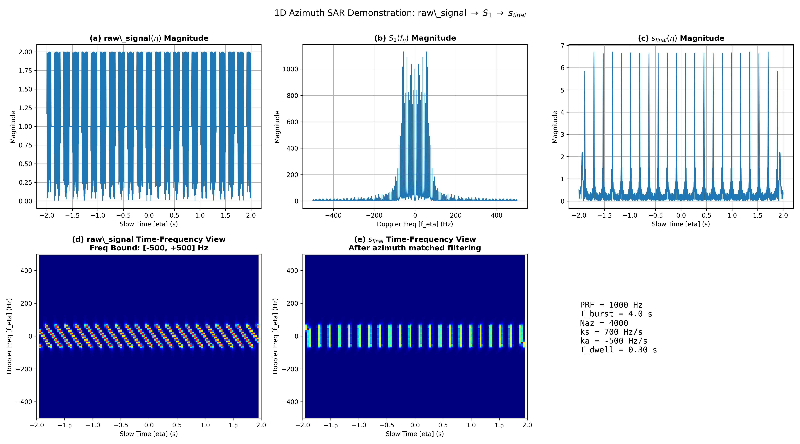
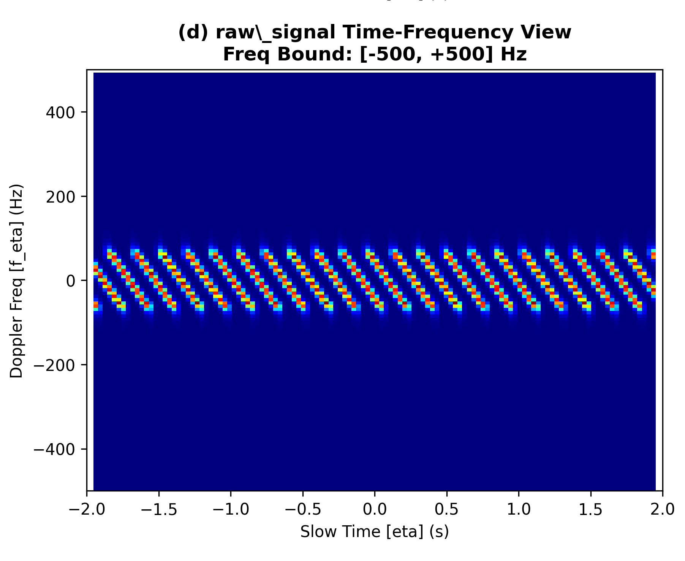
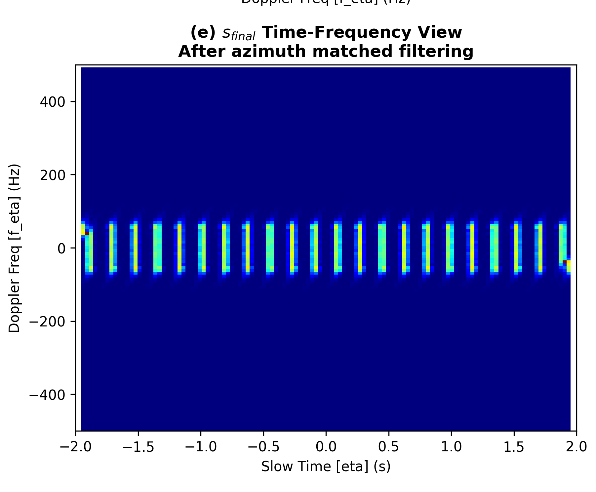
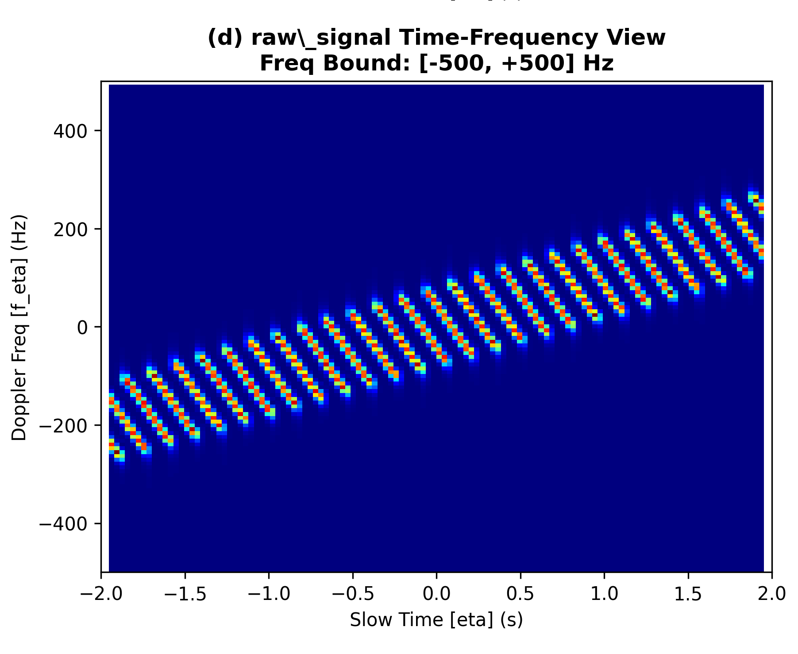
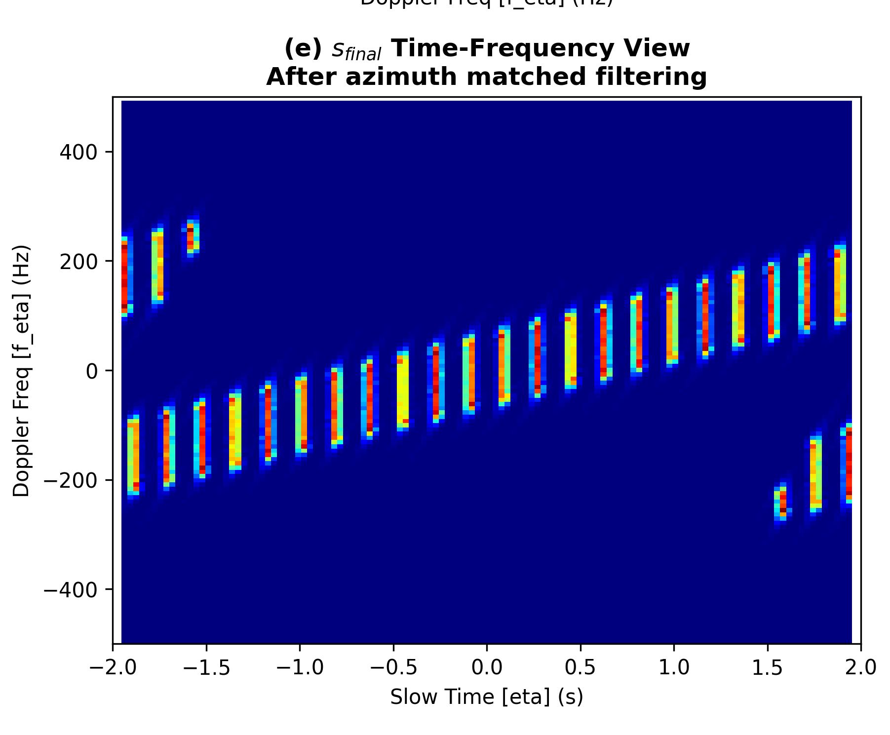
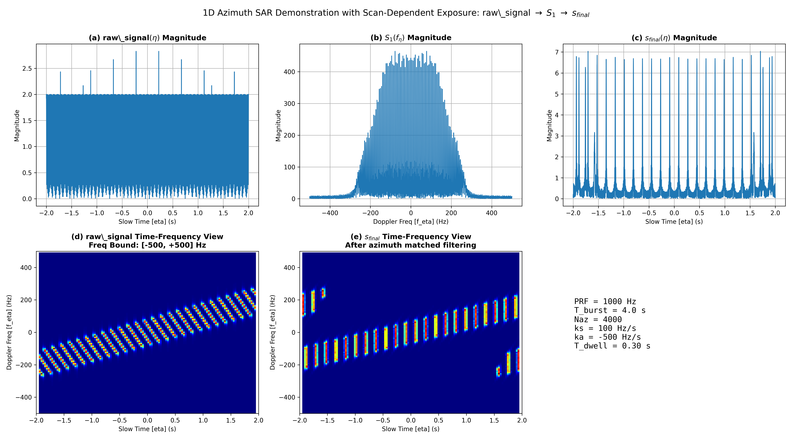

# Explain UFR4: Focused-Time Inflation In TOPS Vs Stripmap

## Navigation

- [Overall](./tops_azimuth_overall.md)
- Companion note: [Explain UFR3](./explain_ufr3.md)
- Related notes:
  - [Azimuth Compression](./azimuth_compression.md)
  - [Azimuth Time Folding](./azimuth_time_folding.md)
  - [Azimuth Time UFR](./azimuth_time_ufr.md)

## Table of Contents

- [Summary](#summary)
- [Problem Definition](#problem-definition)
- [Symbols And Assumptions](#symbols-and-assumptions)
- [1. Common Raw-Signal Model](#1-common-raw-signal-model)
- [2. Case A: Stripmap-Like Reference](#2-case-a-stripmap-like-reference)
- [3. Case B: TOPS-Like Scan-Dependent Exposure](#3-case-b-tops-like-scan-dependent-exposure)
- [4. Focused-Time Inflation Formula](#4-focused-time-inflation-formula)
- [Final Result](#final-result)

## Summary

- `explain_UFR4.py` 的重點不是完整 UFR，而是比較兩種 exposure geometry。
- Case A 用 `$t_{\mathrm{expo}} = t_c$`，代表 illumination center 與 focus-center label 一致。
- Case B 用 `$t_{\mathrm{expo}} = \frac{k_a}{k_a-k_s} t_c$`，代表 TOPS-like 掃描把 illumination trajectory 扭斜。
- 同一個 raw burst window 若沿 `$t_{\mathrm{expo}}$` 被截斷，映到 focused domain 的 `$t_c$` 之後，TOPS-like case 會對應到更長的 focused-time span。
- 因此這份文件要解釋的是：為什麼 TOPS 相比 stripmap 更容易出現 focused-time 膨脹與 time wrap-around 風險。

## Problem Definition

本文件要回答兩件事：

1. `explain_UFR4.py` 的兩個 case 在數學上差在哪裡。
2. 為什麼 `$t_{\mathrm{expo}} \neq t_c$` 會導致 focused-time inflation。

## Symbols And Assumptions

- $\eta$：azimuth slow time
- $f_\eta$：azimuth frequency
- $T_{\mathrm{burst}}$：raw burst duration
- $\mathrm{PRF}$：azimuth sampling rate
- $k_a$：target azimuth FM rate
- $k_s$：scan-induced Doppler-centroid rate
- $T_{\mathrm{dwell}}$：illumination dwell time
- $t_c$：target focus-center label
- $t_{\mathrm{expo}}$：raw slow-time 中的 exposure center
- $s_{\mathrm{raw}}(\eta)$：synthetic raw azimuth signal
- $S_1(f_\eta)$：raw signal 的 azimuth spectrum
- $H_{\mathrm{az}}(f_\eta)$：azimuth matched filter
- $s_{\mathrm{final}}(\eta)$：focus 後的時間域輸出

假設如下：

- 本文只做一維 azimuth demonstration。
- Case A 是 stripmap-like reference，不代表完整 stripmap 幾何重建。
- Case B 是 TOPS-like exposure model，重點是 illumination slope 改變了 raw-to-focus 的座標映射。

## 1. Common Raw-Signal Model

Figure Caption:
這張總覽圖顯示程式中共同使用的一維 azimuth chain：`raw_signal -> S_1 -> matched filtering -> s_final`。兩個 case 的不同，只在 `$t_{\mathrm{expo}}$` 的定義。

Mathematical Step:
每個 scatterer 都共享同一個 raw-signal model。

Fully Expanded Closed Form:

$$
s_{\mathrm{raw},p}(\eta) =
\mathrm{rect}\left(
\frac{\eta-t_{\mathrm{expo},p}}{T_{\mathrm{dwell}}}
\right)
\exp\left(
j\pi k_a(\eta-t_{c,p})^2
\right)
$$

$$
{\color{red}
s_{\mathrm{raw}}(\eta) =
\sum_p
\mathrm{rect}\left(
\frac{\eta-t_{\mathrm{expo},p}}{T_{\mathrm{dwell}}}
\right)
\exp\left(
j\pi k_a(\eta-t_{c,p})^2
\right)
}
$$

$$
S_1(f_\eta) = \mathcal{F}_\eta\left[s_{\mathrm{raw}}(\eta)\right]
$$

$$
H_{\mathrm{az}}(f_\eta) =
\exp\left(
j\pi \frac{f_\eta^2}{k_a}
\right)
$$

$$
{\color{red}
s_{\mathrm{final}}(\eta) =
\mathcal{F}^{-1}_\eta\left[
S_1(f_\eta)H_{\mathrm{az}}(f_\eta)
\right]
}
$$

Physical Meaning:
這支程式不是在比較 matched filter 本身，而是在比較 raw signal 裡面 `$t_{\mathrm{expo}}$` 的幾何定義如何改變最後的 focused support。

Why This Leads To The Next Figure:
既然兩個 case 共用同一條處理鏈，那麼差異一定只會來自 exposure geometry。

## 2. Case A: Stripmap-Like Reference

Figure Caption:
這張圖是 stripmap-like 參考情況的 raw time-frequency view。各條 chirp traces 的 illumination center 與 focus-center label 對齊。

Mathematical Step:
Case A 直接令 exposure center 等於 focus-center label。

Fully Expanded Closed Form:

$$
{\color{red}
t_{\mathrm{expo}} = t_c
}
$$

$$
s_{\mathrm{raw},A}(\eta) =
\sum_p
\mathrm{rect}\left(
\frac{\eta-t_{c,p}}{T_{\mathrm{dwell}}}
\right)
\exp\left(
j\pi k_a(\eta-t_{c,p})^2
\right)
$$

Physical Meaning:
在這個 case 中，raw signal 中目標出現的時間與後來應該聚焦的位置是一致的，因此 raw burst support 映到 focused domain 時不會被額外拉伸。

Why This Leads To The Next Figure:
既然 raw geometry 沒有被扭斜，focus 後的時間支撐就會成為一個基準參考。

Figure Caption:
這張圖顯示 stripmap-like 參考情況下的 focused time-frequency view。能量被壓縮，但 focused support 並沒有額外膨脹。

Mathematical Step:
Case A 只是一般的 azimuth matched filtering：

Fully Expanded Closed Form:

$$
{\color{red}
s_{\mathrm{final},A}(\eta) =
\mathcal{F}^{-1}_\eta\left[
\mathcal{F}_\eta\left[s_{\mathrm{raw},A}(\eta)\right]
H_{\mathrm{az}}(f_\eta)
\right]
}
$$

Physical Meaning:
這裡最重要的不是聚焦本身，而是把它當成「沒有 focused-time inflation」時的對照組。

Why This Leads To The Next Figure:
有了這個基準之後，就可以看出 TOPS-like case 為什麼會不一樣。

## 3. Case B: TOPS-Like Scan-Dependent Exposure

Figure Caption:
這張圖是 TOPS-like case 的 raw time-frequency view。和 Case A 相比，chirp traces 的可見範圍與中心位置已被 scan-dependent exposure 改變。

Mathematical Step:
Case B 把 exposure center 改成掃描率控制的函數。

Fully Expanded Closed Form:

$$
{\color{red}
t_{\mathrm{expo}} = \frac{k_a}{k_a-k_s}t_c
}
$$

$$
{\color{red}
s_{\mathrm{raw},B}(\eta) =
\sum_p
\mathrm{rect}\left(
\frac{\eta-\frac{k_a}{k_a-k_s}t_{c,p}}{T_{\mathrm{dwell}}}
\right)
\exp\left(
j\pi k_a(\eta-t_{c,p})^2
\right)
}
$$

Physical Meaning:
TOPS-like case 改變的不是 matched filter，而是目標在 raw burst 內被照亮的時刻。也就是說，beam scanning 先扭斜了 exposure geometry，再間接造成 focused-time inflation。

Why This Leads To The Next Figure:
一旦 `$t_{\mathrm{expo}}$` 不再等於 `$t_c$`，同一個 raw burst window 在 focused domain 裡就不可能維持同樣長度。

Figure Caption:
這張圖顯示 TOPS-like case 的 focused time-frequency view。目標仍然可以被聚焦，但能量支撐相對於 raw burst geometry 已被拉長。

Mathematical Step:
Case B 的聚焦公式形式與 Case A 一樣，但輸入訊號不同。

Fully Expanded Closed Form:

$$
{\color{red}
s_{\mathrm{final},B}(\eta) =
\mathcal{F}^{-1}_\eta\left[
\mathcal{F}_\eta\left[s_{\mathrm{raw},B}(\eta)\right]
H_{\mathrm{az}}(f_\eta)
\right]
}
$$

Physical Meaning:
這張圖說明問題不是「不能聚焦」，而是「聚焦之後的時間支撐比原本 burst window 更寬」。這正是 time wrap-around 與後續 time UFR 必須存在的原因。

Why This Leads To The Next Figure:
既然現象已經被圖上看見，就可以把它整理成 focused-time inflation 的公式。

## 4. Focused-Time Inflation Formula

Figure Caption:
這張總覽圖提醒你：Case B 的所有變化都來自 `$t_{\mathrm{expo}}$` 與 `$t_c$` 的映射關係，而不是來自不同的 matched filter。

Mathematical Step:
把 `$t_{\mathrm{expo}} = \frac{k_a}{k_a-k_s}t_c$` 反解成 focused-coordinate mapping。

Fully Expanded Closed Form:

$$
{\color{red}
t_c = \frac{k_a-k_s}{k_a} t_{\mathrm{expo}}
}
$$

若 raw burst 的 exposure support 為

$$
|t_{\mathrm{expo}}| \le \frac{T_{\mathrm{burst}}}{2}
$$

則 focused support 近似滿足

$$
|t_c|
\le
\left|
\frac{k_a-k_s}{k_a}
\right|
\frac{T_{\mathrm{burst}}}{2}
$$

因此

$$
{\color{red}
T_{\mathrm{focused}}
\approx
\left|
\frac{k_a-k_s}{k_a}
\right|
T_{\mathrm{burst}}
}
$$

而 stripmap-like 基準則是

$$
T_{\mathrm{focused,stripmap}} \approx T_{\mathrm{burst}}
$$

Physical Meaning:
只要 `$k_s \neq 0$` 且與 `$k_a$` 反號，TOPS-like case 的 focused-time span 就會比原本 raw burst window 更長。這個幾何放大效應就是 focused-time inflation。

Why This Leads To The Next Figure:
這已經是最後的整理公式，沒有下一步；它直接說明為什麼 TOPS 相比 stripmap 更需要 time-domain unfolding。

## Final Result

`explain_UFR4.py` 的核心不是 UFR 實作，而是用兩個最小對照 case 說明：

- 若 `$t_{\mathrm{expo}} = t_c$`，則 focused-time span 不會因 exposure geometry 額外拉長
- 若 `$t_{\mathrm{expo}} = \frac{k_a}{k_a-k_s}t_c$`，則固定的 raw burst window 會映射成更長的 focused support

因此這份文件的定位就是：當你看到圖時，立刻就在圖下面看到它對應的數學與物理，並理解 TOPS vs stripmap 的 focused-time 差異到底從哪裡來。
