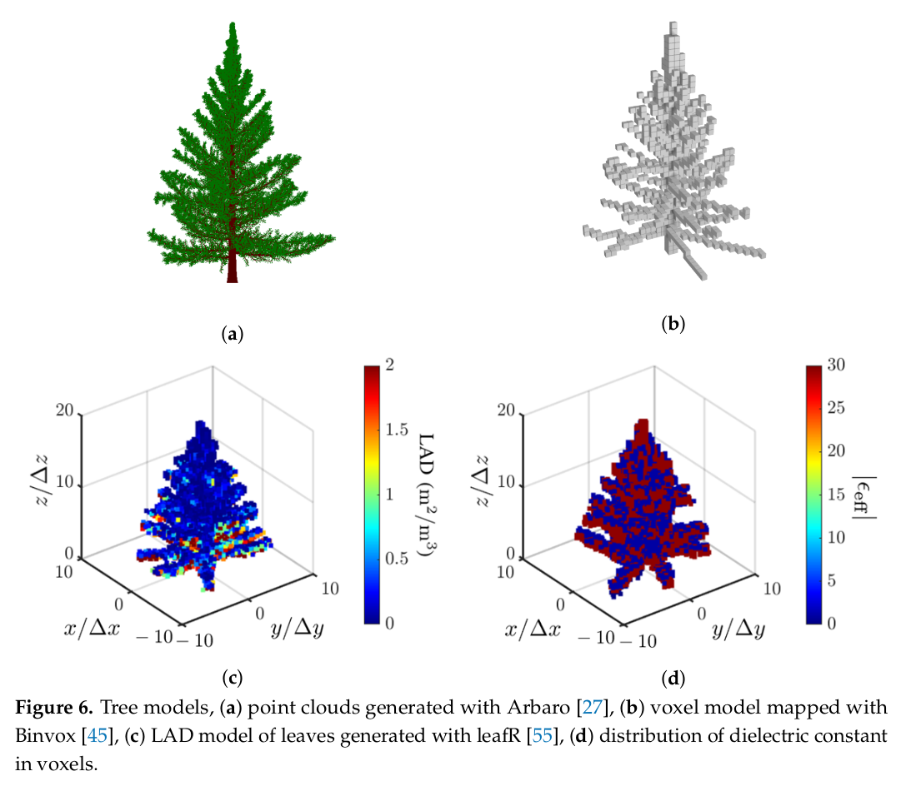
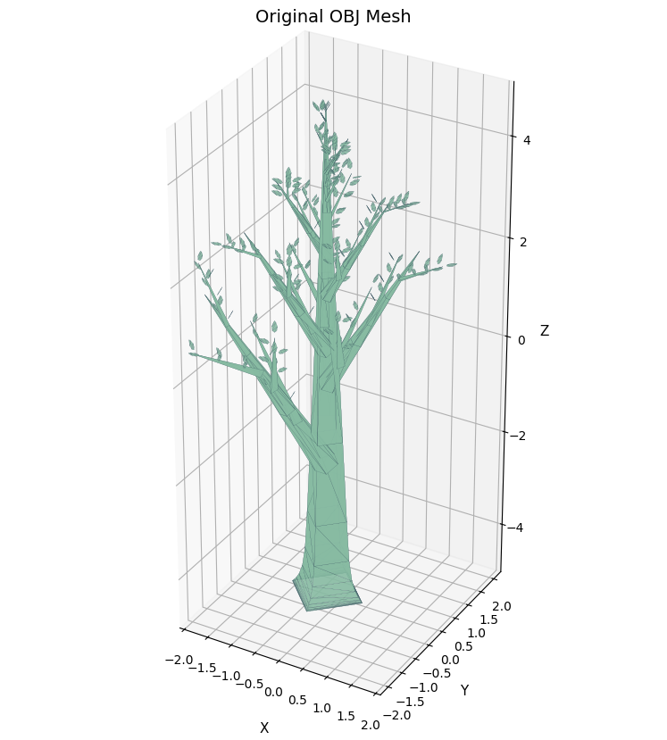
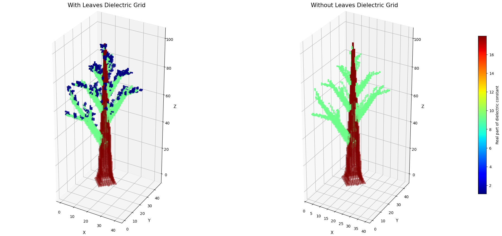

# Voxel-based tree model generation

Reference voxel-model generation:

New voxel-model generation workflow:

## Summary

Figure shows an example of a tree model with dielectric constant distribution in voxels.

- 目前 workflow 以 `Arbaro` 匯出的 OBJ 為輸入，直接在 Python 中完成：
    - mesh normalization
    - group parsing for leaves / branches
    - common voxel lattice construction
    - dielectric constant assignment
    - `with leaves` / `without leaves` comparison
- 目前主程式是 [test_voxel_gen.py](./test_voxel_gen.py)，參數入口是 [tree_voxel_config.json](./configs/tree_voxel_config.json)。

### Workflow summary

| item | current design |
|---|---|
| input | `Arbaro` exported OBJ |
| processing | normalize tree pose, split leaves / branches, rasterize to one common voxel lattice |
| dielectric modeling | Maxwell-Garnett based effective dielectric constant |
| comparison mode | `with leaves` vs `without leaves` |
| primary outputs | `with_leaves_voxel.npy`, `without_leaves_voxel.npy` |
| visualization | original mesh, optional occupancy grids, side-by-side dielectric comparison |

### Config summary

The JSON config is divided into six blocks:

| block | purpose | key fields |
|---|---|---|
| `input` | input dataset location | `obj_path` |
| `output` | output directory and file names | `output_dir`, `with_leaves_voxel_file_name`, `without_leaves_voxel_file_name`, `save_npy` |
| `voxel` | voxel lattice resolution | `pitch` |
| `display` | visualization switches | `show_original_mesh`, `show_leaf_grid`, `show_branch_grid` |
| `grouping` | OBJ group classification rules | `leaves_keywords`, `branches_keywords` |
| `dielectric` | dielectric model parameters | `frequency_ghz`, `epsilon_leaf_real`, `epsilon_leaf_imag`, `moisture_content`, `sigma`, `leaf_volume_fraction`, `branch_volume_fraction`, `show_dielectric` |

### Input / output summary

| type | description |
|---|---|
| input OBJ | tree geometry exported from `Arbaro` |
| `with_leaves_voxel.npy` | complex dielectric grid with both leaves and branches included |
| `without_leaves_voxel.npy` | complex dielectric grid with branch contribution only and leaf contribution removed |

### Main functions summary

| function / class | role |
|---|---|
| `TreeVoxelizerConfig.from_json` | load and validate config |
| `TreeVoxelizer.run` | execute the full pipeline |
| `load_mesh` | load the full OBJ mesh |
| `load_grouped_meshes` | split OBJ groups into leaves and branches |
| `build_normalization_transform` | recenter the tree and align the major growth axis to `+z` |
| `rasterize_to_reference_grid` | map leaves / branches into one common voxel lattice |
| `build_dielectric_grids` | generate `with leaves` and `without leaves` dielectric grids |
| `epsilon_air_leaf` | compute effective dielectric constant for air-leaf mixture |
| `epsilon_wood` | compute wood dielectric constant |
| `epsilon_effective_air_leaf_branch` | compute voxel-level effective dielectric constant |
| `show_dielectric_comparison` | display two dielectric grids side by side with a shared color scale |

### 1. Arbaro

- Figure 6a shows an example of point clouds of a tree generated with `Arbaro` [1].
- `Arbaro` is a open-source software for generating realistic tree models. It can create detailed 3D models of trees based on user-defined parameters such as **tree species, branch structure, leaf density, and overall shape**.

- Setup
    - Download Arbaro from: https://sourceforge.net/projects/arbaro/
    - 檢查系統是否已安裝 Java `java -version` 
    - 如果未安裝 Java，請使用以下命令安裝：`sudo apt update && sudo apt install default-jre`
    - Open Arbaro with `java -jar arbaro.jar`
    - Export format: `Wavefront OBJ`
    - 開啟 OBJ 檔：可以使用 3D 模型查看器（如 MeshLab、Blender）或專業的 CAD 軟件（如 AutoCAD、SolidWorks）。Blender是免費的，或是網頁板的3d viewer（如 https://3dviewer.net/ ）。
    - OBJ 檔通常包含頂點（vertices）、面（faces）和紋理（textures）等資訊，可以用來進行後續的分析或轉換，例如生成 voxel 模型。

### 2. Binvox (python取代)

Figure 6b shows the voxel model mapped from the point clouds with `Binvox` [2]. Each
voxel is a cubic of size 0.5 m, the same as the range and azimuth resolutions specified in
Table 1. The effective dielectric constant in each voxel is estimated by applying the Maxwell-
Garnett mixing formula to the constituent leaves, branches and trunks. 
- binvox 原生操作有很多限制，很麻煩不好改
- 寫了一版python代替

### 3. leafR (python取代)
Figure 6c shows the LAD model of leaves generated with `leafR` [3], and Figure 6d shows the distribution
of the dielectric constant in voxels of the tree model.
- leafR 是一個 R package，專門用來計算葉片的 Leaf Area Index (LAI) 和相關的葉片分布函數（LAD）。它可以根據輸入的樹木參數（如樹高、葉片密度、葉片厚度等）生成葉片的空間分布模型。
- `R`語言不熟，操作不好改
- 寫了一版python代替
- 目前版本先按照 paper 的參數計算出等效介電常數，後續可以更新參數來計算葉片分布與介電常數。

### 5. Dielectric constant model

本節的目的，是把每一個 voxel 視為由 air, leaves, 與 branches 組成的混合介質，並以有效介質理論估算其複數介電常數，而不是直接指定一個任意常數值。

目前 Python 實作採用 paper 中的 Maxwell-Garnett mixing formula，並在同一個 voxel lattice 上同時計算兩組 dielectric grids：

- `with leaves`: leaves 與 branches 同時參與混合
- `without leaves`: 保留 branch contribution，並將 leaf contribution 設為 0

這樣的設計可以直接回答本研究的核心比較問題：**在相同幾何與相同 voxel lattice 下，leaves 對 dielectric distribution 的貢獻有多大。**

#### 5.0. Current implementation assumptions

- 目前版本是 prototype，因此有幾個明確假設：
    - 每個有 leaves 的 voxel 先給固定的 $V_\ell$
    - 每個有 branches 的 voxel 先給固定的 $V_b$
    - `with leaves` 與 `without leaves` 共用同一個 voxel lattice
    - 目前比較圖使用 dielectric constant 的實部作為顏色映射
- 這個版本的優點是結構清楚、易於做 sensitivity study。
- 這個版本的限制是：
    - $V_\ell$ 與 $V_b$ 仍然是固定參數，不是 voxel-wise estimated density
    - 還沒有引入 leafR 或 field measurement 對應的 density model

#### 5.1. Leaf dielectric constant

- 葉片的複數介電常數定義為

$$
\epsilon_{\ell} = \epsilon_{\ell}' - j \epsilon_{\ell}'' = 15.33 - j 5.26
$$

#### 5.2. Air-leaf mixture

- 若 voxel 由 air 與 leaves 組成，則其有效介電常數寫成 air-leaf mixture

$$
\epsilon_{a\ell} = \epsilon_{a\ell}' - j \epsilon_{a\ell}''
$$

- 其實部為

$$
\epsilon_{a\ell}' 
= \frac{1 + \frac{2V_\ell}{3}(\epsilon_{\ell}' - 1)}
{1 + \frac{V_\ell}{3}\left(\frac{\epsilon_{\ell}'}{|\epsilon_{\ell}|^2} - 1\right)}
$$

- 其虛部為

$$
\epsilon_{a\ell}'' =
\frac{ \frac{V_\ell}{3}\epsilon_{\ell}'' \left(2 + \frac{\epsilon_{a\ell}'}{|\epsilon_{\ell}|^2}\right) }
{ 1 + \frac{V_\ell}{3}\left(\frac{\epsilon_{\ell}'}{|\epsilon_{\ell}|^2} - 1 \right) }
$$

- 其中 $V_\ell$ 是 leaf volume fraction，用來描述該 voxel 內葉片佔據的體積比例。

#### 5.3. Leaf volume fraction

- 在文獻中，leaf volume fraction 可寫成

$$
V_\ell = \frac{LAI \cdot t_\ell}{h}
$$

- 其中：
    - $LAI$ 是 leaf area index
    - $t_\ell$ 是平均 leaf thickness
    - $h$ 是 voxel size

- 在目前 Python prototype 中，$V_\ell$ 先視為可調參數，對有 leaves 的 voxel 給定固定值。
- 後續若要提高物理一致性，$V_\ell$ 可以改成：
    - 由 LAI / LAD 推回來的 voxel-wise density
    - 由 local smoothing 後的 leaf occupancy 估計
    - 由 field measurement 或 canopy model 標定

#### 5.4. Wood dielectric constant

- trunk 與 branches 的介電常數以 wood dielectric constant 建模

$$
\epsilon_w = \epsilon_r
+ v_{fw}\left(4.9 + \frac{75}{1 + j f_c/18} + \frac{j18\sigma}{f_c}\right)
+ v_{bw}\left(2.9 + \frac{55}{\sqrt{j f_c/0.18}}\right)
$$

- 其中

$$
\epsilon_r = 1.7 - 0.74M_g + 6.16M_g^2
$$

$$
v_{fw} = M_g(0.55M_g - 0.076)
$$

$$
v_{bw} = \frac{4.64M_g^2}{1 + 7.36M_g^2}
$$

- 其中：
    - $M_g$ 是 wood moisture content
    - $f_c$ 是 carrier frequency
    - $\sigma$ 是 conductivity of free water
- 需注意這裡的 $v_{bw}$ 是 wood model 內部的 bound-water related term，與後續混合模型中的幾何體積分率不是同一個符號。
- 在目前程式實作中，trunk 與 branch 會分別指定不同的 moisture content，因此實際上會得到：
    - `trunk`: $\epsilon_{w,t} = \epsilon_w(M_{g,t})$
    - `branch`: $\epsilon_{w,b} = \epsilon_w(M_{g,b})$
- 這一部分主要控制 trunk 與 branch material response，因此對 `without leaves` 的結果特別重要。

#### 5.5. Air-leaf-branch mixture

- 若 voxel 同時包含 air, leaves, 與 woody material，則背景介質從 air 改成 air-leaf mixture $\epsilon_{a\ell}$，其有效介電常數可寫成

$$
\epsilon_{eff}
= \epsilon_{a\ell}
+ \frac{
(\epsilon_w - \epsilon_{a\ell})(\epsilon_w + 5\epsilon_{a\ell})V_w
}{
3(\epsilon_w + \epsilon_{a\ell}) - 2(\epsilon_w - \epsilon_{a\ell})V_w
}
$$

- 其中 $V_w$ 是 woody volume fraction。
- 在目前程式中，這個式子會依 voxel 類型代入不同參數：
    - branch voxel: $\epsilon_w = \epsilon_{w,b}$，$V_w = V_{b}$
    - trunk voxel: $\epsilon_w = \epsilon_{w,t}$，$V_w = V_{t}$
- 也就是說，目前程式不是把 trunk 和 branch 視為完全相同的 woody voxel，而是分別以不同的 moisture content 與 volume fraction 建模。

#### 5.6. Why two dielectric outputs are generated

- 目前程式會輸出兩個 dielectric grids：
    - `with_leaves_voxel.npy`
    - `without_leaves_voxel.npy`
- 兩者的差別只在於 $V_\ell$ 是否參與混合。
- 這樣的設計有兩個好處：
    - 可以在完全相同的 voxel lattice 上直接比較 leaves 的貢獻
    - 後續若要做 SAR backscatter sensitivity study，可以把 leaves 當成單一控制變數

整體來說，這一版 dielectric model 的定位是「可比較、可重現、可擴充」的 prototype：

- 可比較：`with leaves` 與 `without leaves` 使用同一個 voxel lattice
- 可重現：主要參數都集中在 JSON config 中管理
- 可擴充：後續可把固定的 $V_\ell$、$V_b$、$V_t$ 替換成 voxel-wise density model，而不必重寫整個 pipeline

#### 5.7. Suggested next refinement

- 若未來要讓 dielectric model 更接近實際森林場景，優先建議的改進順序是：
    - 先把固定的 $V_\ell$ 改成 voxel-wise leaf density
    - 再把固定的 $V_b$、$V_t$ 改成 branch / trunk geometry based density
    - 最後再加入 frequency sweep 與 parameter calibration

### 6. Parameter table

| parameter | symb. | tamarack | quaking aspen | tamarack (dry) |
|---|---|---|---|---|
| tree species |  | tamarack | quaking aspen | tamarack (dry) |
| country |  | U.S. | U.S. | U.S. |
| canopy height | $H_c$ | 21 m | 15 m | 21 m |
| trunk diameter | $D_t$ | 33 cm | 25 cm | 33 cm |
| DC of trunk | $\epsilon_w$ | $29.47 - j 9.39$ | $17.48 - j 5.92$ | $8.27 - j 2.83$ |
| wood moisture const. | $M_g$ | 0.7 g/m$^3$ | 0.5 g/m$^3$ | 0.2 g/m$^3$ |
| radius of branch | $r_b$ | 0.03 m | 0.03 m | 0.03 m |
| length of branch | $\ell_b$ | 0.5 m | 0.5 m | 0.5 m |
| density of branch | $n_b$ | 20 /m$^3$ | 20 /m$^3$ | 20 /m$^3$ |
| volume fraction of branches | $V_b$ | 0.23 | 0.23 | 0.23 |
| DC of leaf | $\epsilon_{\ell}$ | $15.33 - j 5.26$ | $13 - j 6.38$ | no leaf |
| avg. leaf thickness | $t_\ell$ | 0.03 cm | 0.03 cm | no leaf |
| leaf area index | $LAI$ | [0, 5.78] | [0, 2.59] | [0, 2.59] |
| volume fraction of leaves | $V_\ell$ | [0, 0.0173] | [0, 0.0132] | [0, 0.0132] |
| effective DC of air&leaf | $\epsilon_{a\ell}$ | $\epsilon_{a\ell}' : [1, 1.13]$, $\epsilon_{a\ell}'' : [0, 0.06]$ | $\epsilon_{a\ell}' : [1, 1.13]$, $\epsilon_{a\ell}'' : [0, 0.05]$ | $\epsilon_{a\ell}' : [1, 1.13]$, $\epsilon_{a\ell}'' : [0, 0.05]$ |
| effective DC of air&leaf&branch | $\epsilon_{eff}$ | $\epsilon_{eff} : [1, 29.49]$ | $\epsilon_{eff} : [1, 17.48]$ | $\epsilon_{eff} : [1, 8.27]$ |
| DC of ground | $\epsilon_g$ | 4 | 4 | 4 |
| voxel size | $h^3$ | $0.5^3$ m$^3$ | $0.5^3$ m$^3$ | $0.5^3$ m$^3$ |

DC: dielectric constant

[1] Diestel, W. Arbaro-Tree Generation for Povray. 2003. Available online: https://arbaro.sourceforge.net/

[2] Patrick, M. Binvox 3D Mesh Voxelizer. 2004. Available online: https://www.patrickmin.com/binvox/

[3] Almeida, D.R.A.D.; Stark, S.C.; Silva, C.A.; Hamamura, C.; Valbuena, R. leafR: Calculates the Leaf Area Index (LAD) and Other
Related Functions. CRAN, 2019. Available online: https://cran.r-project.org/src/contrib/Archive/leafR/
